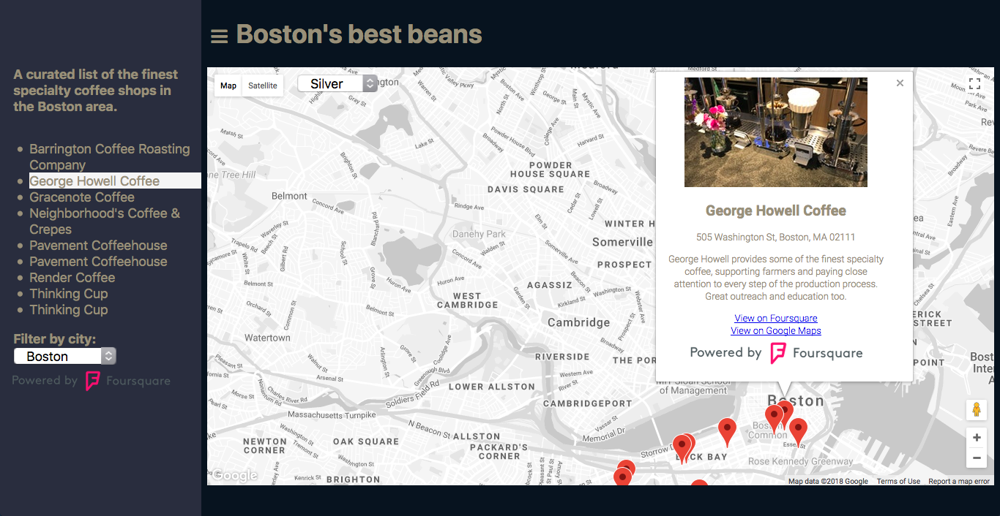

# README

Udacity Full Stack Web Developer Nanodegree program

[Project 5. JavaScript Map](https://github.com/br3ndonland/udacity-fsnd-p5-map)

Brendon Smith

[br3ndonland](https://github.com/br3ndonland)

## Table of Contents <!-- omit in toc -->

- [Description](#description)
- [Repository contents](#repository-contents)
- [Code style](#code-style)

## Description

Boston's finest coffee, brought to you by Foursquare and Google Maps.

- This is a single-page web application that displays "Boston's best beans," a list of specialty coffee shops in the Boston area. To run the application locally, simply clone or download the repository and open *index.html* in a web browser.
- The [Google Maps Platform](https://cloud.google.com/maps-platform/) is used to generate a map in *index.html*. A style selector allows the user to change the map style to suit their preferences.
- The location list is retrieved from the [Foursquare API](https://developer.foursquare.com/) using JavaScript with Fetch and async/await in *index.js*. Errors are handled with a try/catch block.
- Clicking the hamburger icon &#9776; in the header opens a side navigation menu with the list description and locations. Each location is linked with its corresponding map marker.
- Clicking on a location, either in the side navigation menu or on the map marker, causes the marker to bounce, and opens an info window displaying data on the location from Foursquare.
- Selecting a city from the dropdown menu filters the markers and location list by the selection. The markers are filtered by the Google Maps 'change' event listener, and the location list is filtered by toggling the CSS `display: none` class with `viewModel.toggleList()`.
- [Babel](http://babeljs.io/) provides browser back-compatibility.

## Repository contents

- [info](info)
  - [img](info/img): Images used in the info directory.
  - [map-methods.md](info/map-methods.md): Computational narrative describing how I built the application.
  - [map-udacity-docs.md](info/map-udacity-docs.md): Udacity project description and rubric.
- [static](static)
  - [css](static/css): Application styling.
  - [img](static/img): Images used in the application.
  - [js](static/js): JavaScript application code that fetches data from the [Foursquare API](https://developer.foursquare.com/), uses the [Google Maps Platform](https://cloud.google.com/maps-platform/) to generate a map, and leverages [KnockoutJS](http://knockoutjs.com) to manage user interactions with the webpage.
- [.gitignore](.gitignore): Instructions to Git to exclude certain files from commits.
- [index.html](index.html): Main webpage.
- [README.md](README.md): This file, a concise description of the repository.

## Code style

- JavaScript:
  - [JavaScript Standard Style](https://standardjs.com/)
  - Two-space indentations, no semicolons.
  - Semicolons are syntactic clutter. Much like multivitamins, semicolons provide peace of mind while being of minimal utility. Omitting semicolons, and using ES6 features like template literals (similar to Python 3 string formatting), also allows me to easily switch between JavaScript and Python.
  - There is a StandardJS [vscode extension](https://marketplace.visualstudio.com/items?itemName=chenxsan.vscode-standardjs) available for linting and autoformatting.
- HTML and CSS: Two-space indentations.
- Markdown:
  - Markdown code style follows the suggestions for standardized Markdown formatting provided by [markdownlint](https://github.com/DavidAnson/markdownlint) and [Markdown Style Guide](http://www.cirosantilli.com/markdown-style-guide/).
  - The [vscode](https://code.visualstudio.com/) extension [Markdown All in One](https://marketplace.visualstudio.com/items?itemName=yzhang.markdown-all-in-one) is used to insert a Table of Contents after the corresponding h2.
  - Further syntactic standards:
    - Two space indentations.
    - Dashes for unordered lists.
    - The h1 first-level header is reserved for the title of the file and included on the first line, like `# Title`.

[(Back to TOC)](#table-of-contents-<!---omit-in-toc--->)
