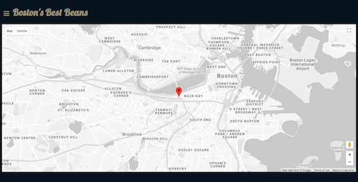
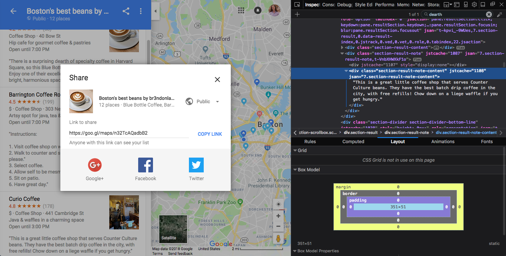
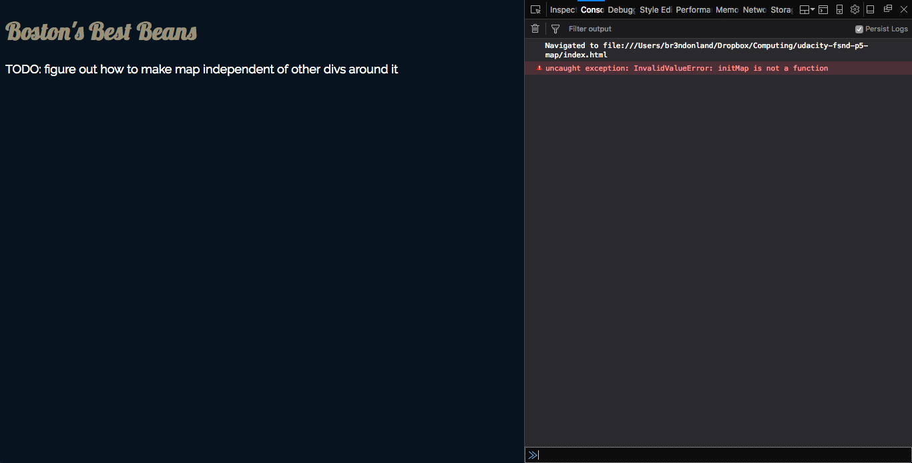
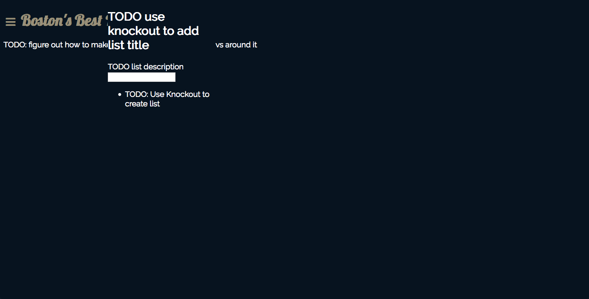
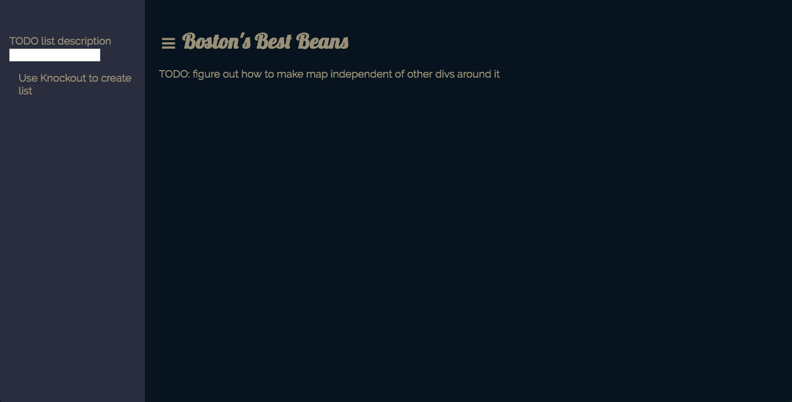

# Computational narrative

<a href="https://www.udacity.com/">
  
</a>

Udacity Full Stack Web Developer Nanodegree program

[Project 5. JavaScript Knockout Neighborhood Map](https://github.com/br3ndonland/udacity-fsnd-p5-map)

Brendon Smith

br3ndonland

## Table of Contents

- [Table of Contents](#table-of-contents)
- [Prep](#prep)
  - [Directory setup](#directory-setup)
  - [Practice and coursework](#practice-and-coursework)
- [Page layout](#page-layout)
- [Google Maps](#google-maps)
  - [Map](#map)
  - [Location list fail](#location-list-fail)
- [Foursquare](#foursquare)
- [Knockout](#knockout)
  - [View Model](#view-model)
  - [Model](#model)

## Prep

### Directory setup

- I created the typical directory structure, with static/ containing the css/, img/, and js/ directories for static website content.
- I added info/ for the Udacity documentation and computational narrative.
- In the top-level directory, I added the README.md, and index.html. I got the HTML started by using the `html:5` Emmet snippet in vscode (just save the file as HTML, and type html).

### Practice and coursework

The Full Stack Web Developer Nanodegree program (FSND) doesn't provide introductory training for JavaScript. I started off taking some time to strengthen my JavaScript skills, and then worked through all the associated FSND coursework. The foundational JavaScript and FSND "part 4" lessons took about a week (20180430-20180508).

#### JavaScript syntax

- [x] I checked out the [Udacity Intro to JavaScript](https://www.udacity.com/course/intro-to-javascript--ud803) course, but skipped it, because it's not updated for ES6.
- [x] [Udacity ES6 - JavaScript Improved](https://www.udacity.com/course/es6-javascript-improved--ud356) course
  - I took this course during the [Grow with Google scholarship program](https://github.com/br3ndonland/udacity-google). I reviewed my notes from the course and practiced the syntax.
- [x] [cs50](https://cs50.harvard.edu/)
  - [x] Lecture 11 JavaScript
- [x] [cs50 CSCI E-33a](https://cs50.github.io/web/lectures)
  - [x] Lecture 05 JavaScript
- [ ] [Wes Bos JavaScript30](https://javascript30.com/)

#### JavaScript testing and debugging

- [x] General vscode JavaScript testing and debugging features
  - [x] Shift+Cmd+D, then enter, to run JS file
  - [x] [Quokka.js](https://quokkajs.com):
    - Select "Quokka.js: Start on Current File" and it will run the JS and show output inline.
  - `console.log(varName)` is like `print()` in Python.
- [x] [vscode Node.js tutorial](https://code.visualstudio.com/docs/nodejs/nodejs-tutorial)
- [x] [Firefox debugger playground](https://mozilladevelopers.github.io/playground/debugger/)
- [x] [Wes Bos JavaScript30](https://javascript30.com/) lesson 9, "14 must-know dev tools tricks"

#### FSND coursework

- [x] [Intro to AJAX](https://www.udacity.com/course/intro-to-ajax--ud110)
- [x] [JavaScript Design Patterns](https://www.udacity.com/course/javascript-design-patterns--ud989)
- [x] [Google Maps APIs](https://www.udacity.com/course/google-maps-apis--ud864)

#### KnockoutJS

- [x] [KnockoutJS tutorials](http://learn.knockoutjs.com)
  - [x] KnockoutJS Introduction
  - [x] KnockoutJS Working with lists and collections
  - [x] KnockoutJS Single page applications
  - [x] KnockoutJS Creating custom bindings
  - [x] KnockoutJS Loading and saving data

Knockout is similar to jQuery, but has more app controller functionality. Knockout is outdated and not widely used anymore. I didn't find the tutorials particularly helpful, and the code hasn't been updated for ES6. It would be preferable to use React or Vue.js. Some of the FEND students get to use React for the neighborhood map project.

[(Back to TOC)](#table-of-contents)

## Page layout

- This is a simple one-page web app. Based on the mockup in the project description, I should have a header bar at the top, and a sliding drawer menu on the side.
- The header was simple: just add HTML `<header>` tags before the `<div id="map"></div>`

[(Back to TOC)](#table-of-contents)

## Google Maps

### Map

I completed the [Udacity Google Maps APIs course](https://www.udacity.com/course/google-maps-apis--ud864) and followed the steps in the [Google Maps JavaScript API documentation](https://developers.google.com/maps/documentation/javascript/tutorial) to create the map.

- [Load the Maps JavaScript API](https://developers.google.com/maps/documentation/javascript/tutorial#Loading_the_Maps_API) into *index.html*.
- Add [Map DOM element](https://developers.google.com/maps/documentation/javascript/tutorial#Map_DOM_Elements) to *index.html*.
- [Set Map options](https://developers.google.com/maps/documentation/javascript/tutorial#MapOptions)
  - center
  - zoom
  - style: I used the [Map Styler tool](https://mapstyle.withgoogle.com/) and the [styling instructions in the Google Maps JavaScript API docs](https://developers.google.com/maps/documentation/javascript/styling) to create an elegant silver map. It's also possible to [provide a menu with multiple style options](https://developers.google.com/maps/documentation/javascript/examples/style-selector).
  - I kept the JavaScript in *index.js*.
  - The map requires CSS with `height` attributes for `body` and `#map`.
  - I attempted to change `var map` to `const map`, but wasn't able to get it to work.
  - I was thinking about using the drawing tools to draw a border around Back Bay, but I expanded my list of coffee shops to the greater Boston area, so I didn't need the Back Bay border.
- I added a simple drop animation for the marker using the [marker instructions in the Google Maps API docs](https://developers.google.com/maps/documentation/javascript/markers).
- Here's what the app looks like so far:

  

- Git commit at this point: Style page and map c95c601

### Location list fail

Manually inputting a location array is inefficient and static. Rather than manually input an array, I decided to create a list in Google Maps and access the JSON from the list. This way, if the list is updated (if I add more coffee shops, for example), the app will automatically have the new information.

Place lists were [added to Google Maps about a year ago](https://blog.google/products/maps/keep-track-your-favorite-places-and-share-them-friends/).

I curated a list of my favorite coffee shops in the Boston area, ["Boston's best beans by br3ndonland"](https://goo.gl/maps/wmHnqRoFfhz), and added notes about each place.

- Barrington Coffee Roasters
- Blue Bottle Coffee Harvard Square
- Curio Coffee
- George Howell Coffee
- Gracenote Coffee
- Intelligentsia Coffeebar Watertown
- Neighborhoods Coffee and Crepes
- Pavement Coffeehouse Fenway
- Pavement Coffeehouse Newbury St
- Render Coffee South End
- Thinking Cup Newbury St
- Thinking Cup Tremont St

I should be able to query the [Places library](https://developers.google.com/maps/documentation/javascript/places) and see place details JSON for all locations in the list. Unfortunately, **Google doesn't provide an API for places lists.** Lists also don't seem to be search indexed, are not included in the user's Google Maps contributions, and don't seem to be exported through Google Takeout. Typical. Thanks Google.

I spent basically two days of my life trying to hack out some JSON. I tried modifying the [full URL](https://www.google.com/maps/@42.357817,-71.1045126,13z/data=!3m1!4b1!4m3!11m2!2s1FhPRrcoV52Jiqi8htc75zZ5IELc!3e3) in the style of [Place details requests](https://developers.google.com/maps/documentation/javascript/places#place_details), to no avail. I tried to interrogate the page data with developer tools also.



I looked for a more developer-friendly API. I checked out [Factual](https://www.factual.com/) and [Yelp](https://www.yelp.com/developers), but decided on [Foursquare](https://developer.foursquare.com/).

- Factual
  - Found Factual with a DuckDuckGo search "json api list of favorite restaurants" -> [Quora page](https://www.quora.com/What-is-the-best-API-source-for-access-to-a-restaurant-database) -> [Factual](https://www.factual.com/)
  - Looks a little heavy and enterprise-y for this project.
- [Yelp](https://www.yelp.com/developers)
  - Documentation is so-so
  - I haven't used Yelp in a long time because I got tired of the nauseatingly effusive reviews.

While I was struggling with this, Udacity actually removed the Google Maps requirement from the rubric (May 11 2018). I considered switching to [OpenStreetMap](https://www.openstreetmap.org). **I decided to retain Google Maps for the map and markers, and pull data from another API for the locations and info.**

[(Back to TOC)](#table-of-contents)

## Foursquare

- I already had a developer account set up from the [API lessons](https://github.com/br3ndonland/udacity-fsnd/blob/master/4-web-apps/apis/apis.md). I started by reviewing the notes and code from those lessons.
- Creating my ["Boston's best beans" Foursquare list](https://foursquare.com/user/480979057/list/bostons-best-beans) and adding places to the list was quick and easy in the Android app. I also added photos and tips (short reviews).
- You can query the API to [get details of a list](https://developer.foursquare.com/docs/api/lists/details)! What's up now, Google?
- The list details query requires the `LIST_ID`. It's not necessarily present in the URL for the list itself. I found the `LIST_ID` (5af879722b9844322f1aba96) by using the [Foursquare API explorer](https://foursquare.com/developers/explore) to view my lists ([https://api.foursquare.com/v2/users/self/lists](https://api.foursquare.com/v2/users/self/lists)). The API explorer is a helpful tool that allows developers to browse and fold JSON.
- Next, I worked on parsing the list JSON and getting terminal output with Python and JavaScript.
  - It was, naturally, easier with Python. The `json.loads()` method adds the JSON to the Python program as a dictionary (array). It was easy to step through the nested levels of the JSON dictionary and pull out the data I wanted. Iterating over the venues with a `for` loop took more time to figure out, but still made sense.
  - Python code in *foursquare-list.py*

    ```python
    import json
    import requests

    url = 'https://api.foursquare.com/v2/lists/5af879722b9844322f1aba96'

    params = dict(client_id='PASTE_CLIENT_ID_HERE',
                  client_secret='PASTE_CLIENT_SECRET_HERE',
                  v='20180323')
    resp = requests.get(url=url, params=params)
    data = json.loads(resp.text)

    # If this file is called as a standalone program:
    if __name__ == '__main__':
        # Display output in terminal
        print('\nResponse code: {}'.format(data['meta']['code']),
              '\nList name: {}'.format(data['response']['list']['name']),
              '\nList author: {} {}'.format(data['response']['list']['user']['firstName'],
                                            data['response']['list']['user']['lastName']),
              '\nList description: {}'.format(data['response']['list']['description']),
              '\nVenues:')
        # Iteration method to return info for each venue
        # This method is syntactically similar to JavaScript
        items = data['response']['list']['listItems']['items']
        for item in items:
            print('{}, {}, {}'.format(item['venue']['name'], item['venue']['location']['address'],
                                      item['venue']['location']['city']))
        # Alternative iteration method
        for i in data['response']['list']['listItems']['items']:
            print('{}, {}, {}'.format(i['venue']['name'], i['venue']['location']['address'],
                                      i['venue']['location']['city']))

    ```

  - <details><summary>Terminal output from <em>foursquare-list.py</em></summary>

    ```text
    Response code: 200
    List name: Boston's best beans
    List author: Brendon Smith
    List description: This is a personally curated list of the finest specialty coffee shops in Boston.
    Venues:
    Gracenote Coffee, 108 Lincoln St, Boston
    Curio Coffee, 441 Cambridge St, Cambridge
    Thinking Cup, 85 Newbury St, Boston
    Blue Bottle Coffee, 40 Bow St, Cambridge
    Thinking Cup, 165 Tremont St, Boston
    George Howell Coffee, 505 Washington St, Boston
    Render Coffee, 563 Columbus Ave, Boston
    Neighborhood's Coffee & Crepes, 96 Peterborough St, Boston
    Barrington Coffee Roasting Company, 303 Newbury St, Boston
    Pavement Coffeehouse, 286 Newbury St, Boston
    Pavement Coffeehouse, 1334 Boylston Street, Boston
    Intelligentsia Watertown Coffeebar, 810 Mount Auburn St, Watertown
    ```

    </details>

  - For JavaScript, I used the [`JSON.parse()` method](https://developer.mozilla.org/en-US/docs/Web/JavaScript/Reference/Global_Objects/JSON/parse) to return an array. I was able to easily pull the response code, list name, list author and list description from the JSON array.

    ```js
    const data = JSON.parse(body)
    const code = `\nResponse code: ${data.meta.code}`
    const listName = `\nList name: ${data.response.list.name}`
    const listAuthor = `\nList author: ${data.response.list.user.firstName} ${data.response.list.user.lastName}`
    const listDescription = `\nList description: ${data.response.list.description}`
    console.log(code, listName, listAuthor, listDescription, `\nVenues:\n`)
    ```

  - It took me about a day to figure out how to iterate over the JSON array. My first iteration attempt threw an error:

    ```js
    const items = data.response.list.listItems.items
    for (const item of items) {
      let venueInfo = `${venue.name}, ${venue.location.address}, ${venue.location.city}`
      console.log(`${venueInfo}`)
    }
    ```

  - I was able to pull the list of 12 venue ids. This told me I was at least on the right track, because my list had 12 locations.

    ```js
    const items = data.response.list.listItems.items
    for (const item of items) {
      console.log(item.id)
    }
    ```

  - I couldn't use the same strategy to get the venue names. The code below just returns "undefined" 12 times, but again, at least the number is correct.

    ```js
    const items = data.response.list.listItems.items
    for (const item of items) {
      console.log(item.name)
    }
    ```

  - The solution was to go one level deeper in the JSON array. Each location actually has `venue` info nested below the top level `id`.

    ```js
    const items = data.response.list.listItems.items
    for (const item of items) {
      console.log(`${item.venue.name}, ${item.venue.location.address}, ${item.venue.location.city}`)
    }
    ```

  - I also wrote a `forEach` loop for comparison:

    ```js
    items.forEach(item => {
      console.log(`${item.venue.name}, ${item.venue.location.address}, ${item.venue.location.city}`)
    })
    ```

  - JavaScript code in *foursquare-list.js*

    ```js
    const request = require('request')

    request({
      url: 'https://api.foursquare.com/v2/lists/5af879722b9844322f1aba96',
      method: 'GET',
      qs: {
        client_id: 'PASTE_CLIENT_ID_HERE',
        client_secret: 'PASTE_CLIENT_SECRET_HERE',
        v: '20180323'
      }
    },

    function (err, res, body) {
      if (err) {
        console.error(err)
      } else {
        const data = JSON.parse(body)
        const code = `\nResponse code: ${data.meta.code}`
        const listName = `\nList name: ${data.response.list.name}`
        const listAuthor = `\nList author: ${data.response.list.user.firstName} ${data.response.list.user.lastName}`
        const listDescription = `\nList description: ${data.response.list.description}`
        console.log(code, listName, listAuthor, listDescription, `\nVenues:\n`)
        const items = data.response.list.listItems.items
        for (const item of items) {
          console.log(`${item.venue.name}, ${item.venue.location.address}, ${item.venue.location.city}`)
        }
        items.forEach(item => {
          console.log(`${item.venue.name}, ${item.venue.location.address}, ${item.venue.location.city}`)
        })
      }
    })

    ```
  - The iterator `i` can be used instead of `item`.
  - The JavaScript is actually a server-side Node.js module. I will convert the server-side code to run client-side in the browser.
  - Git commit at this point: Query Foursquare API with Python and JavaScript 2ba7a8d

[(Back to TOC)](#table-of-contents)

## Knockout

Now that I have my API endpoints established, I need to structure the app with Knockout. I had already completed the [JavaScript Design Patterns](https://www.udacity.com/course/javascript-design-patterns--ud989) course, and worked through the [KnockoutJS tutorials](http://learn.knockoutjs.com).

### View Model

#### Starting off with app title

- I tried to build Knockout in around my Google Maps code, but it wasn't working. I started from scratch and began by adding the Knockout code structure.
- Neither the documentation nor the Udacity lessons gave me a clear idea of how to structure the app.
  - Why is `viewModel` a variable, and not a function?
  - What should be included in `viewModel`, and what should be separate?
- Let's start with the app title. I declared the title as a simple Knockout variable, and then set a binding in the HTML.
  - *index.js*

    ```js
    // ViewModel (Knockout controller)

    const viewModel = {
      appTitle: "Boston's Best Beans"
    }

    ko.applyBindings(viewModel)
    ```

  - *index.html*

    ```html
    <!-- head and start of body above -->
    <header class="header-title">
      <h1>
        <span data-bind="text: appTitle"></span>
      </h1>
    </header>
    <!-- body continues below -->
    ```

    

  - Success. The error in the browser console in the screenshot above is because of the Google Maps URL in *index.html*. Note that, after I build in the Foursquare API, I can pull the list title and change the title to a `ko.observable()`, so that it will update automatically when changed.

#### Sidenav

- I decided to build in the side navigation menu before incorporating Google Maps and Foursquare into the Knockout app.
- I used the HTML unicode `&#9776;` for the hamburger icon in the header. Encoding the hamburger as a character instead of an icon or image allowed me to use the same style as the header title.
- I used an `<aside>` element for the side navigation menu.
- Side navigation menus are also called "sidenav" or "off-canvas menus."
- I started with the [sidenav tutorial from w3schools](https://www.w3schools.com/howto/howto_js_sidenav.asp), modifying the JavaScript to handle click events with Knockout.
- The sidenav tutorial uses separate buttons to open and close the sidenav. I wanted to use the hamburger icon for both opening and closing the sidenav. I therefore created a `toggleSidenav ()` function.
- The JavaScript basically changes the page margins when the hamburger icon is clicked.
- <details><summary>First attempt at sidenav in <em>index.js</em></summary>

  ```js
  const viewModel = {
    appTitle: "Boston's Best Beans",
    toggleSidenav: function () {
      const sidenav = document.getElementById('sidenav')
      const main = document.getElementById('main')
      if (model.toggleSidenav === true) {
        model.toggleSidenav = false
        sidenav.style.width = '250px'
        sidenav.style.marginLeft = '250px'
      } else {
        model.toggleSidenav = true
        sidenav.style.width = '0px'
        sidenav.style.marginLeft = '0px'
      }
    }
  }
  ```

  </details>

  

- Alright, that sorta worked. Now, I need to push the main page, not just drop content on top of it. I just had to change `sidenav.style.marginLeft` to `main.style.marginLeft`.
- Toggle: I used CSS to convert the cursor to pointer when hovering over the hamburger toggle. At first, it took two clicks to get the sidenav to open. I just had to reverse the margin settings.
  - Two clicks on the hamburger to open:

    ```js
    if (model.toggleSidenav === true) {
      model.toggleSidenav = false
      sidenav.style.width = '250px'
      main.style.marginLeft = '250px'
    } else {
      model.toggleSidenav = true
      sidenav.style.width = '0px'
      main.style.marginLeft = '0px'
    }
    ```

  - Corrected so one click on the hamburger opens sidenav:

    ```js
    if (model.toggleSidenav === true) {
      model.toggleSidenav = false
      sidenav.style.width = '0px'
      main.style.marginLeft = '0px'
    } else {
      model.toggleSidenav = true
      sidenav.style.width = '250px'
      main.style.marginLeft = '250px'
    }
    ```

    

- Next, I worked on the CSS. I gave the sidenav the same background as the [Palenight Material Theme](https://github.com/equinusocio/vsc-material-theme/blob/master/src/themes/settings/specific/palenight.json), and set margins, padding and other properties.
- Transition and animation
  - I'm not totally happy with the transition. I would like the text in the sidenav to be static, and just have the main page pull back, instead of having the sidenav text roll in.
  - I looked into CSS animations, rather than transitions.
  - I read [Google's "Building performant expand & collapse animations" post](https://developers.google.com/web/updates/2017/03/performant-expand-and-collapse). I found out that Google does not recommend animating width and height because of slow performance.

    >The immediate problem with this approach is that it requires animating width and height. These properties require calculating layout and paint the results on every frame of the animation, which can be very expensive, and will typically cause you to miss out on 60fps. If that’s news to you then read our [Rendering Performance](https://developers.google.com/web/fundamentals/performance/rendering/) guides, where you can get more information on how the rendering process works.

  - Some of the [examples in the GoogleChromeLabs GitHub repo](https://github.com/GoogleChromeLabs/ui-element-samples) look useful.
- Responsive design
  - The sidenav push also doesn't look great on mobile devices, because it crunches the main page into a tiny space. It would be helpful to include some media queries to turn the sidenav into a topnav on mobile devices. I'm not sure how to coordinate the media queries with JavaScript right now, so I will save it for later.
- I decided to just move on, and leave the animation and responsive design for later. It was taking too much time and it's not essential to the app.

#### Google Maps and Knockout

- My first objective was to figure out how to **nest the `<div id="map">` within `<main>` in the HTML.**
  - This is something that had been bugging me since I started using the Google Maps API. In yet another one of Google's oversights, the Google Maps JavaScript API docs don't explain how to nest the map div. I went back through the [overview](https://developers.google.com/maps/documentation/javascript/tutorial) and thought carefully about each step. The Map DOM Elements section says:

    >Map DOM Elements
    >
    >```html
    ><div id="map"></div>
    >```
    >
    >For the map to display on a web page, we must reserve a spot for it. Commonly, we do this by creating a named div element and obtaining a reference to this element in the browser's document object model (DOM).
    >
    >In the example above, we used CSS to set the height of the map div to "100%". This will expand to fit the size on mobile devices. You may need to adjust the width and height values based on the browser's screensize and padding. Note that divs usually take their width from their containing element, and empty divs usually have 0 height. For this reason, you must always set a height on the `<div>` explicitly.

  - Google clearly explains that `<div id="map"></div>` requires a CSS `height` style attribute. **Google doesn't explain that any `div` enclosing the map must also have its height set with CSS.** In the past, when I nested the map `div` within `main`, the map would disappear. When I set a height attribute for `main`, the map reappeared.
- My next objective was to **integrate the map with Knockout.**
  - I took the opportunity here to [provide a menu with multiple style options](https://developers.google.com/maps/documentation/javascript/examples/style-selector).
  - I was having some difficulty getting the map to function properly when contained within the `const viewModel` object. In the browser console, the page was throwing the error `uncaught exception: InvalidValueError: initMap is not a function`. I think this was because the `&callback=initMap` in the Google Maps URL in *index.html* was no longer recognizing the JavaScript. I tried changing the callback to `&callback=viewModel.initMap`, but it was not successful.
  - I decided to keep the Google Maps JavaScript outside of the Knockout objects.

Google Maps can be used to handle click events, but this project requires that click events be handled by Knockout.

### Model

*TODO* model properties as [observables](http://knockoutjs.com/documentation/observables.html)

*TODO* make JSON array an [observable array](http://knockoutjs.com/documentation/observableArrays.html)?

*TODO* access foursquare data with ajax call?

*TODO* error handling: modify google maps link in html, add function to viewModel

*TODO* use knockout to filter location list by open now

*TODO* use knockout to handle click events

*TODO*: display tips in infoWindow

[(Back to TOC)](#table-of-contents)