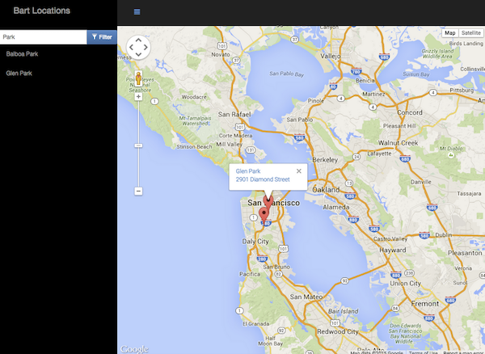
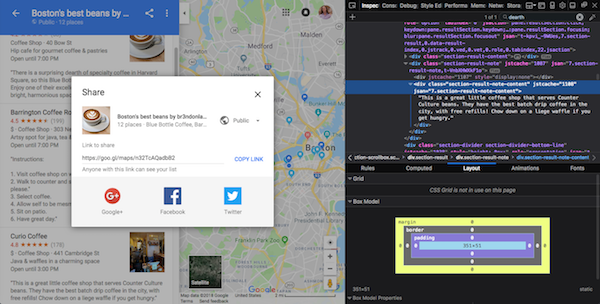
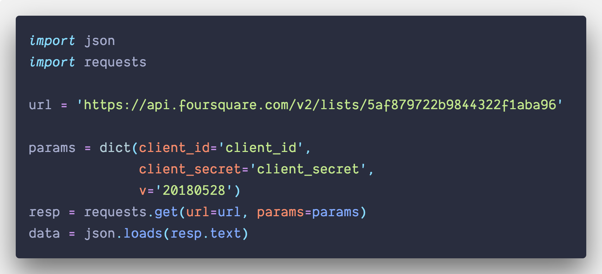
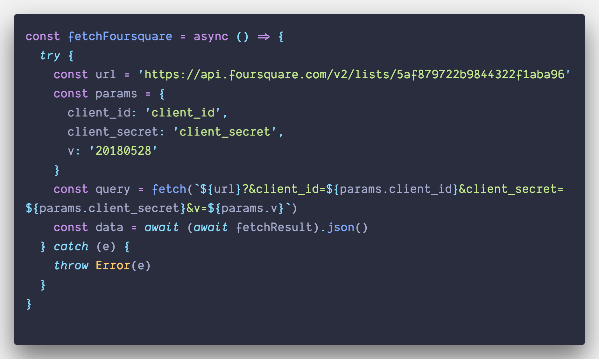
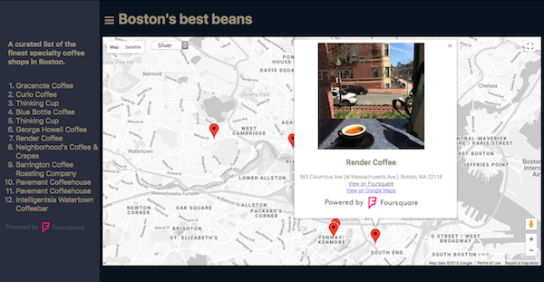
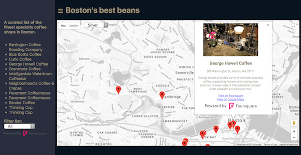
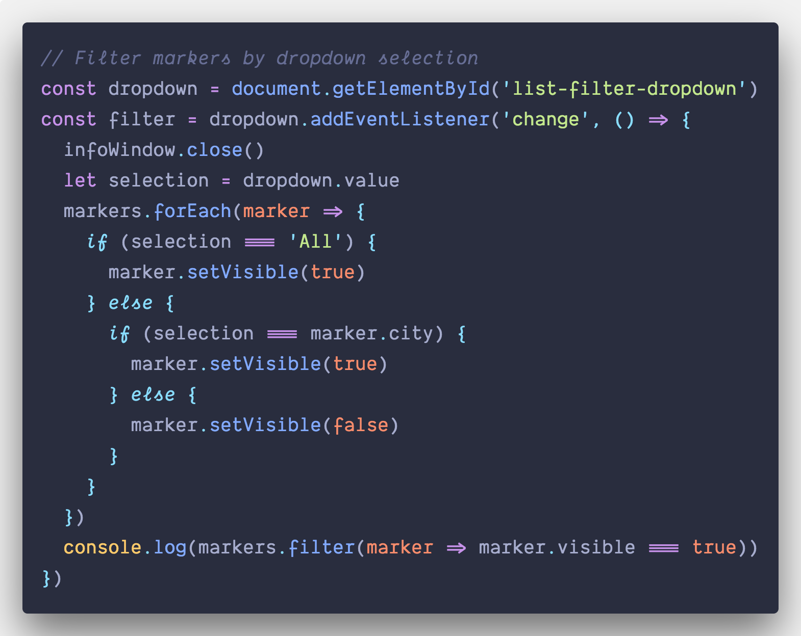
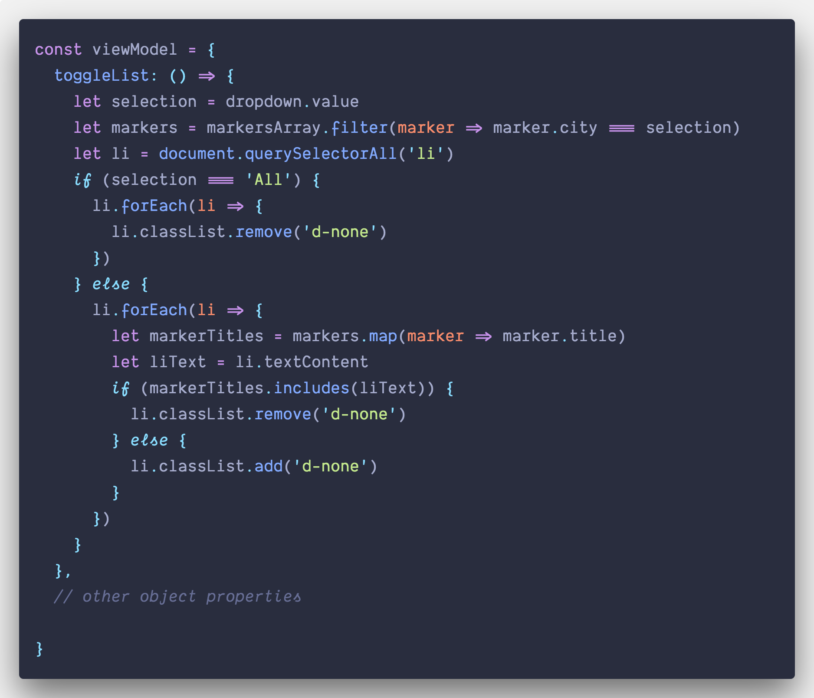

# Computational narrative

<a href="https://www.udacity.com/">
  
</a>

Udacity Full Stack Web Developer Nanodegree program

[Project 5. JavaScript Map](https://github.com/br3ndonland/udacity-fsnd-p5-map)

Brendon Smith

[br3ndonland](https://github.com/br3ndonland)

## Table of Contents <!-- omit in toc -->

- [Setup](#setup)
  - [Practice and coursework](#practice-and-coursework)
  - [Directory setup](#directory-setup)
  - [Page setup](#page-setup)
- [Google Maps](#google-maps)
  - [Map setup](#map-setup)
  - [Map style](#map-style)
  - [Google Maps list fail](#google-maps-list-fail)
- [Asynchronous HTTP requests](#asynchronous-http-requests)
  - [Foursquare API queries](#foursquare-api-queries)
  - [Asynchronous HTTP request method selection](#asynchronous-http-request-method-selection)
  - [Learning Fetch](#learning-fetch)
  - [Async await](#async-await)
  - [Foursquare with Fetch and async await](#foursquare-with-fetch-and-async-await)
- [Bringing it all together](#bringing-it-all-together)
  - [Variable scope](#variable-scope)
  - [Markers](#markers)
  - [Info Windows](#info-windows)
  - [Location list for nav menu](#location-list-for-nav-menu)
- [Deployment](#deployment)

## Setup

### Practice and coursework

The Full Stack Web Developer Nanodegree program (FSND) doesn't provide introductory training for JavaScript. I started off taking some time to strengthen my JavaScript skills, and then worked through all the associated FSND coursework. The foundational JavaScript and FSND "part 4" lessons took about a week (20180430-20180508).

#### JavaScript syntax

- [x] [MDN JavaScript Guide](https://developer.mozilla.org/en-US/docs/Web/JavaScript/Guide)
- [x] I checked out the [Udacity Intro to JavaScript](https://www.udacity.com/course/intro-to-javascript--ud803) course, but skipped it, because it's not updated for ES6.
- [x] [Udacity ES6 - JavaScript Improved](https://www.udacity.com/course/es6-javascript-improved--ud356) course
  - I took this course during the [Grow with Google scholarship program](https://github.com/br3ndonland/udacity-google). I reviewed my notes from the course and practiced the syntax.
- [x] [cs50](https://cs50.harvard.edu/)
  - [x] Lecture 11 JavaScript
- [x] [cs50 CSCI E-33a](https://cs50.github.io/web/lectures)
  - [x] Lecture 05 JavaScript

#### JavaScript testing and debugging

- [x] General vscode JavaScript testing and debugging features
  - [x] Shift+Cmd+D, then enter, to run JS file
  - [x] [Quokka.js](https://quokkajs.com): Select "Quokka.js: Start on Current File" and it will run the JS and show output inline. `console.log()` is like `print()` in Python.
- [x] [vscode Node.js tutorial](https://code.visualstudio.com/docs/nodejs/nodejs-tutorial)
- [x] [Firefox debugger playground](https://mozilladevelopers.github.io/playground/debugger/)
- [x] [Wes Bos JavaScript30](https://javascript30.com/) lesson 9, "14 must-know dev tools tricks"

#### FSND coursework

- [x] [Intro to AJAX](https://www.udacity.com/course/intro-to-ajax--ud110)
- [x] [JavaScript Design Patterns](https://www.udacity.com/course/javascript-design-patterns--ud989)
- [x] [Google Maps APIs](https://www.udacity.com/course/google-maps-apis--ud864)

#### KnockoutJS

- [x] [KnockoutJS tutorials](http://learn.knockoutjs.com)
  - [x] KnockoutJS Introduction
  - [x] KnockoutJS Working with lists and collections
  - [x] KnockoutJS Single page applications
  - [x] KnockoutJS Creating custom bindings
  - [x] KnockoutJS Loading and saving data

- I need to structure the app with Knockout. I had already completed the [JavaScript Design Patterns](https://www.udacity.com/course/javascript-design-patterns--ud989) course, and worked through the [KnockoutJS tutorials](http://learn.knockoutjs.com). Knockout is sort of like an inferior predecessor to React. I didn't enjoy working with it, but was required to for the project. I didn't find the tutorials particularly helpful, and the code hasn't been updated for ES6. I did find it interesting to look at the source code though, which appears to be written in a functional programming paradigm.
- I originally planned to access KnockoutJS via a [CDN](https://cdnjs.cloudflare.com/ajax/libs/knockout/3.4.2/knockout-min.js), but it was too slow and the requests were frequently failing, so I included it locally instead.
- In order to debug in an isolated environment within vscode, I installed Knockout from npm, and required Fetch and Knockout at the top of the JavaScript file:

  ```js
  const fetch = require('node-fetch')
  const ko = require('knockout')
  ```

- I then turned on [Quokka](http://quokkajs.com/) for live results.

[(Back to TOC)](#table-of-contents)

### Directory setup

- I created the typical directory structure, with static/ containing the css/, img/, and js/ directories for static website content.
- I added info/ for the Udacity documentation and computational narrative.
- In the top-level directory, I added the README.md, and index.html. I got the HTML started by using the `html:5` Emmet snippet in vscode (just save the file as HTML, and type html).
- For the favicon, I temporarily wrote the coffee cup HTML unicode character `&#9749;` &#9749; as an `h2` in the webpage, took a 32x32 screenshot of it, and saved the screenshot to the img directory.

### Page setup

#### Page layout

- This is a simple one-page web app. Based on the mockup in the project description, I should have a header bar at the top, and a sliding drawer navigation menu on the side.

  

- The header was simple: just add HTML `<header>` tags before the `<div id="map"></div>`

#### App title

- I tried to build Knockout in around my Google Maps code, but it wasn't working. I started from scratch and began by adding the Knockout code structure.
- Neither the documentation nor the Udacity lessons gave me a clear idea of how to structure the app.
- Let's start with the app title. I declared the title as a simple Knockout variable, and then set a binding in the HTML.
  - *index.js*

    ```js
    // ViewModel (Knockout controller)

    const viewModel = {
      appTitle: "Boston's Best Beans"
    }

    ko.applyBindings(viewModel)
    ```

  - *index.html*

    ```html
    <!-- head and start of body above -->
    <header class="header-title">
      <h1>
        <span data-bind="text: appTitle"></span>
      </h1>
    </header>
    <!-- body continues below -->
    ```

    

  - Success. The error in the browser console in the screenshot above is because of the Google Maps URL in *index.html*. Note that, after I build in the Foursquare API, I can pull the list title from the JSON instead of hardcoding it.

#### Nav menu

- I decided to build in the side navigation menu before incorporating Google Maps and Foursquare into the Knockout app.
- I used the HTML unicode `&#9776;` for the hamburger icon in the header. Encoding the hamburger as a character instead of an icon or image allowed me to use the same style as the header title.
- I used an `<aside>` element for the side navigation menu.
- Side navigation menus are also called "sidenav" or "off-canvas menus."
- I started with the [sidenav tutorial from w3schools](https://www.w3schools.com/howto/howto_js_sidenav.asp), modifying the JavaScript to handle click events with Knockout.
- The sidenav tutorial uses separate buttons to open and close the sidenav. I wanted to use the hamburger icon for both opening and closing the sidenav. I therefore created a `toggleSidenav ()` function.
- The JavaScript basically changes the page margins when the hamburger icon is clicked.
- <details><summary>First attempt at sidenav in <em>index.js</em></summary>

  ```js
  const viewModel = {
    appTitle: "Boston's Best Beans",
    toggleSidenav: function () {
      const sidenav = document.getElementById('sidenav')
      const main = document.getElementById('main')
      if (model.toggleSidenav === true) {
        model.toggleSidenav = false
        sidenav.style.width = '250px'
        sidenav.style.marginLeft = '250px'
      } else {
        model.toggleSidenav = true
        sidenav.style.width = '0px'
        sidenav.style.marginLeft = '0px'
      }
    }
  }
  ```

  </details>

  

- Alright, that sorta worked. Now, I need to push the main page, not just drop content on top of it. I just had to change `sidenav.style.marginLeft` to `main.style.marginLeft`.
- Toggle: I used CSS to convert the cursor to pointer when hovering over the hamburger toggle. At first, it took two clicks to get the sidenav to open. I just had to reverse the margin settings.
  - Two clicks on the hamburger to open:

    ```js
    if (model.toggleSidenav === true) {
      model.toggleSidenav = false
      sidenav.style.width = '250px'
      main.style.marginLeft = '250px'
    } else {
      model.toggleSidenav = true
      sidenav.style.width = '0px'
      main.style.marginLeft = '0px'
    }
    ```

  - Corrected so one click on the hamburger opens sidenav:

    ```js
    if (model.toggleSidenav === true) {
      model.toggleSidenav = false
      sidenav.style.width = '0px'
      main.style.marginLeft = '0px'
    } else {
      model.toggleSidenav = true
      sidenav.style.width = '250px'
      main.style.marginLeft = '250px'
    }
    ```

    

- Next, I worked on the CSS. I gave the sidenav the same background as the [Palenight Material Theme](https://github.com/equinusocio/vsc-material-theme/blob/master/src/themes/settings/specific/palenight.json), and set margins, padding and other properties.
- Transition and animation
  - I'm not totally happy with the transition. I would like the text in the sidenav to be static, and just have the main page pull back, instead of having the sidenav text roll in. Also, because the width is being changed, a scroll bar momentarily appears as the content is scrunched down.
  - Scott Tolinski from [Level Up Tutorials](https://www.leveluptutorials.com/) has some helpful [tutorials](https://youtu.be/ccqRk7Ehru4) using CSS transforms.
  - I looked into CSS animations, rather than transitions.
  - I read [Google's "Building performant expand & collapse animations" post](https://developers.google.com/web/updates/2017/03/performant-expand-and-collapse). I found out that Google does not recommend animating width and height because of slow performance.

    >The immediate problem with this approach is that it requires animating width and height. These properties require calculating layout and paint the results on every frame of the animation, which can be very expensive, and will typically cause you to miss out on 60fps. If that’s news to you then read our [Rendering Performance](https://developers.google.com/web/fundamentals/performance/rendering/) guides, where you can get more information on how the rendering process works.

  - Some of the [examples in the GoogleChromeLabs GitHub repo](https://github.com/GoogleChromeLabs/ui-element-samples) look useful.
- Responsive design
  - The sidenav push also doesn't look great on mobile devices, because it crunches the main page into a tiny space. It would be helpful to include some media queries to turn the sidenav into a topnav on mobile devices. I'm not sure how to coordinate the media queries with JavaScript right now, so I will save it for later.
- I decided to just move on, and leave the animation and responsive design for later. It was taking too much time and it's not essential to the app.
- Git commit at this point: Add side navigation menu 2b44b1b

[(Back to TOC)](#table-of-contents)

## Google Maps

### Map setup

I completed the [Udacity Google Maps APIs course](https://www.udacity.com/course/google-maps-apis--ud864) and followed the steps in the [Google Maps JavaScript API documentation](https://developers.google.com/maps/documentation/javascript/tutorial) to create the map.

- [Load the Maps JavaScript API](https://developers.google.com/maps/documentation/javascript/tutorial#Loading_the_Maps_API) into *index.html*.
- Add [Map DOM element](https://developers.google.com/maps/documentation/javascript/tutorial#Map_DOM_Elements) to *index.html*.
- [Set Map options](https://developers.google.com/maps/documentation/javascript/tutorial#MapOptions)
  - center
  - zoom
  - style: I used the [Map Styler tool](https://mapstyle.withgoogle.com/) and the [styling instructions in the Google Maps JavaScript API docs](https://developers.google.com/maps/documentation/javascript/styling) to create an elegant silver map. It's also possible to [provide a menu with multiple style options](https://developers.google.com/maps/documentation/javascript/examples/style-selector).
  - I kept the JavaScript in *index.js*.
  - The map requires CSS with `height` attributes for `body` and `#map`.
  - I attempted to change `var map` to `const map`, but wasn't able to get it to work.
  - I also found that the `initMap` function needed to be defined as just a function declaration, like `function initMap () {}`, and not an object, like `var initMap = function () {}`. This is just a limitation of the Google Maps API.
  - I was thinking about using the drawing tools to draw a border around Back Bay, but I expanded my list of coffee shops to the greater Boston area, so I didn't need the Back Bay border.
- I added a simple drop animation for the marker using the [marker instructions in the Google Maps API docs](https://developers.google.com/maps/documentation/javascript/markers).
- Here's what the app looks like so far:

  

- Git commit at this point: Style page and map c95c601

### Map style

- Next, I needed to figure out how to **nest the `<div id="map">` within `<main>` in the HTML.**
  - This is something that had been bugging me since I started using the Google Maps API. In yet another one of Google's oversights, the Google Maps JavaScript API docs don't explain how to nest the map div. I went back through the [overview](https://developers.google.com/maps/documentation/javascript/tutorial) and thought carefully about each step. The Map DOM Elements section says:

    >Map DOM Elements
    >
    >```html
    ><div id="map"></div>
    >```
    >
    >For the map to display on a web page, we must reserve a spot for it. Commonly, we do this by creating a named div element and obtaining a reference to this element in the browser's document object model (DOM).
    >
    >In the example above, we used CSS to set the height of the map div to "100%". This will expand to fit the size on mobile devices. You may need to adjust the width and height values based on the browser's screensize and padding. Note that divs usually take their width from their containing element, and empty divs usually have 0 height. For this reason, you must always set a height on the `<div>` explicitly.

  - Google clearly explains that `<div id="map"></div>` requires a CSS `height` style attribute. **Google doesn't explain that any `div` enclosing the map must also have its height set with CSS.** In the past, when I nested the map `div` within `main`, the map would disappear. When I set a height attribute for `main`, the map reappeared.
- I took the opportunity here to [provide a menu with multiple style options](https://developers.google.com/maps/documentation/javascript/examples/style-selector). It was basically a drop-in from the Google Maps docs.
- Git commit at this point: Nest map div in HTML and add map style selector 9200ee3

### Google Maps list fail

Most previous students have hardcoded a location array directly into the JavaScript, which is inefficient and static. Rather than manually input an array, I decided to create a list in Google Maps and access the JSON from the list. This way, if the list is updated (if I add more coffee shops, for example), the app will automatically have the new information.

Lists were [added to Google Maps about a year ago](https://blog.google/products/maps/keep-track-your-favorite-places-and-share-them-friends/).

I curated a list of my favorite coffee shops in the Boston area, ["Boston's best beans"](https://goo.gl/maps/wmHnqRoFfhz), and added notes about each place.

- Barrington Coffee Roasters
- Blue Bottle Coffee Harvard Square
- Curio Coffee
- George Howell Coffee
- Gracenote Coffee
- Intelligentsia Coffeebar Watertown
- Neighborhoods Coffee and Crepes
- Pavement Coffeehouse Fenway
- Pavement Coffeehouse Newbury St
- Render Coffee South End
- Thinking Cup Newbury St
- Thinking Cup Tremont St

I should be able to retrieve list data in JSON format. Unfortunately, **Google doesn't provide an API for places lists.** Lists also don't seem to be search indexed, are not included in the user's Google Maps contributions, and don't seem to be exported through Google Takeout. Typical. Thanks Google.

I spent basically two days of my life trying to hack out some JSON. I tried modifying the [full URL](https://www.google.com/maps/@42.357817,-71.1045126,13z/data=!3m1!4b1!4m3!11m2!2s1FhPRrcoV52Jiqi8htc75zZ5IELc!3e3) in the style of [Place details requests](https://developers.google.com/maps/documentation/javascript/places#place_details), to no avail. I tried to interrogate the page data with developer tools also.



I looked for a more developer-friendly API. I checked out [Factual](https://www.factual.com/) and [Yelp](https://www.yelp.com/developers), but decided on [Foursquare](https://developer.foursquare.com/).

Notes:

- Factual
  - Found Factual with a DuckDuckGo search "json api list of favorite restaurants" -> [Quora page](https://www.quora.com/What-is-the-best-API-source-for-access-to-a-restaurant-database) -> [Factual](https://www.factual.com/)
  - Looks a little heavy and enterprise-y for this project.
- [Yelp](https://www.yelp.com/developers)
  - Documentation is so-so
  - I haven't used Yelp in a long time because I got tired of the nauseatingly effusive reviews.
- Foursquare
  - Information seems to be current
  - Has an API for lists

While I was struggling with this, Udacity actually removed the Google Maps requirement from the rubric (20180511). I considered switching to [OpenStreetMap](https://www.openstreetmap.org). **I decided to retain Google Maps for the map and markers, and pull data from the Foursquare API for the locations and info.**

[(Back to TOC)](#table-of-contents)

## Asynchronous HTTP requests

### Foursquare API queries

- I already had a developer account set up from the [API lessons](https://github.com/br3ndonland/udacity-fsnd/blob/master/4-web-apps/apis/apis.md). I started by reviewing the notes and code from those lessons.
- Creating my ["Boston's best beans" Foursquare list](https://foursquare.com/user/480979057/list/bostons-best-beans) and adding places to the list was quick and easy in the Android app. I also added photos and tips (short reviews).
- **You can query the API to [get details of a list](https://developer.foursquare.com/docs/api/lists/details)! What's up now, Google?**
- The list details query requires the `LIST_ID`. It's not necessarily present in the URL for the list itself. I found the `LIST_ID` (5af879722b9844322f1aba96) by using the [Foursquare API explorer](https://foursquare.com/developers/explore). The API explorer is a helpful tool that allows developers to browse and fold JSON.
- Next, I worked on parsing the list JSON and getting terminal output with Python and JavaScript.

#### Foursquare and Python

- It was, naturally, easier with Python. The `json.loads()` method adds the JSON to the Python program as a dictionary (array). It was easy to step through the nested levels of the JSON dictionary and pull out the data I wanted. Iterating over the venues with a `for` loop took more time to figure out, but still made sense.

[Polacode](https://marketplace.visualstudio.com/items?itemName=pnp.polacode) snapshot ([vscode](https://code.visualstudio.com/), [material theme palenight](https://marketplace.visualstudio.com/items?itemName=Equinusocio.vsc-material-theme), [Dank Mono](https://dank.sh)):



- <details><summary><strong>Python code in foursquare-list.py</strong></summary>

  ```python
  import json
  import requests

  url = 'https://api.foursquare.com/v2/lists/5af879722b9844322f1aba96'

  params = dict(client_id='client_id',
                client_secret='client_secret',
                v='20180528')
  resp = requests.get(url=url, params=params)
  data = json.loads(resp.text)

  def foursquare_list():
      # Display metadata
      print('\nResponse code: {}'.format(data['meta']['code']),
            '\nList name: {}'.format(data['response']['list']['name']),
            '\nList author: {} {}'.format(data['response']['list']['user']['firstName'],
                                          data['response']['list']['user']['lastName']),
            '\nList description: {}'.format(data['response']['list']['description']),
            '\nVenues:')
      # Iterate over list to return info for each venue
      items = data['response']['list']['listItems']['items']
      for item in items:
          print('{}, {}, {}'.format(item['venue']['name'], item['venue']['location']['address'],
                                    item['venue']['location']['city']))
      pass

  # If this file is called as a standalone program:
  if __name__ == '__main__':
      # Display output in terminal
      foursquare_list()

  ```

  </details>

- <details><summary><strong>Terminal output from <em>foursquare-list.py</em></strong></summary>

  ```text
  Response code: 200
  List name: Boston's best beans
  List author: Brendon Smith
  List description: This is a personally curated list of the finest specialty coffee shops in Boston.
  Venues:
  Gracenote Coffee, 108 Lincoln St, Boston
  Curio Coffee, 441 Cambridge St, Cambridge
  Thinking Cup, 85 Newbury St, Boston
  Blue Bottle Coffee, 40 Bow St, Cambridge
  Thinking Cup, 165 Tremont St, Boston
  George Howell Coffee, 505 Washington St, Boston
  Render Coffee, 563 Columbus Ave, Boston
  Neighborhood's Coffee & Crepes, 96 Peterborough St, Boston
  Barrington Coffee Roasting Company, 303 Newbury St, Boston
  Pavement Coffeehouse, 286 Newbury St, Boston
  Pavement Coffeehouse, 1334 Boylston Street, Boston
  Intelligentsia Watertown Coffeebar, 810 Mount Auburn St, Watertown
  ```

  </details>

- Note that the code above is synchronous, meaning it runs top to bottom, and each line has to complete before the next line can run. [Requests 3](https://www.kennethreitz.org/requests3) will include async/await support for asynchronous HTTP requests in Python.

#### Foursquare and JavaScript

- The JavaScript example in the [Foursquare getting started docs](https://developer.foursquare.com/docs/api/getting-started) uses the [Request](https://www.npmjs.com/package/request) module. To start building on the example from the Foursquare docs, I used the [`JSON.parse()` method](https://developer.mozilla.org/en-US/docs/Web/JavaScript/Reference/Global_Objects/JSON/parse) to return an array. I was able to easily pull the response code, list name, list author and list description from the JSON array.

  ```js
  const data = JSON.parse(body)
  const code = `\nResponse code: ${data.meta.code}`
  const listName = `\nList name: ${data.response.list.name}`
  const listAuthor = `\nList author: ${data.response.list.user.firstName} ${data.response.list.user.lastName}`
  const listDescription = `\nList description: ${data.response.list.description}`
  console.log(code, listName, listAuthor, listDescription, `\nVenues:\n`)
  ```

- It took me about a day to figure out how to iterate over the JSON array. My first iteration attempt threw an error:

  ```js
  const items = data.response.list.listItems.items
  for (const item of items) {
    let venueInfo = `${venue.name}, ${venue.location.address}, ${venue.location.city}`
    console.log(`${venueInfo}`)
  }
  ```

- I was able to pull the list of 12 venue ids. This told me I was at least on the right track, because my list had 12 locations.

  ```js
  const items = data.response.list.listItems.items
  for (const item of items) {
    console.log(item.id)
  }
  ```

- I couldn't use the same strategy to get the venue names. The code below just returns "undefined" 12 times, but again, at least the number is correct.

  ```js
  const items = data.response.list.listItems.items
  for (const item of items) {
    console.log(item.name)
  }
  ```

- The solution was to go one level deeper in the JSON array. Each location actually has `venue` info nested below the top level `id`.

  ```js
  const items = data.response.list.listItems.items
  for (const item of items) {
    console.log(`${item.venue.name}, ${item.venue.location.address}, ${item.venue.location.city}`)
  }
  ```

- The iterator `i` can be used instead of `item`.
- I also wrote a `forEach` loop for comparison:

  ```js
  items.forEach(item => {
    console.log(`${item.venue.name}, ${item.venue.location.address}, ${item.venue.location.city}`)
  })
  ```

- <details><summary><strong>JavaScript code in foursquare-list-request.js</strong></summary>

  ```js
  // Require modules to run file from Node.js outside of browser
  const request = require('request') // https://github.com/request/request

  request({
    url: 'https://api.foursquare.com/v2/lists/5af879722b9844322f1aba96',
    method: 'GET',
    qs: {
      client_id: 'client_id',
      client_secret: 'client_secret',
      v: '20180528'
    }
  },
  (err, res, body) => {
    if (err) {
      console.error(err)
    } else {
      const data = JSON.parse(body)
      // Console log data
      console.group('Foursquare list')
      console.group('Metadata')
      console.log(`Response code: ${data.meta.code}`,
        `\nList name: ${data.response.list.name}`,
        `\nList author: ${data.response.list.user.firstName} ${data.response.list.user.lastName}`,
        `\nList description: ${data.response.list.description}`)
      console.groupEnd('Metadata')
      console.group('Venues')
      const items = data.response.list.listItems.items
      // Iteration methods to return venue info
      const list = items.map(item => {
        console.log(`${item.venue.name}, ${item.venue.location.address}, ${item.venue.location.city}`)
      })
      // Alternative for of iteration method
      // for (const item of items) {
      //   console.log(`${item.venue.name}, ${item.venue.location.address}, ${item.venue.location.city}`)
      // }
      // Alternative forEach iteration method
      // items.forEach(item => {
      //   console.log(`${item.venue.name}, ${item.venue.location.address}, ${item.venue.location.city}`)
      // })
      console.groupEnd('Venues')
      console.groupEnd('Foursquare list')
    }
  })

  ```

  </details>

- Git commit at this point: Query Foursquare API with Python and JavaScript 2ba7a8d

[(Back to TOC)](#table-of-contents)

### Asynchronous HTTP request method selection

- I wasn't sure if I wanted to use the Request module, so I spent some time learning about asynchronous HTTP requests (Ajax).
- I started off reading about [Ajax on MDN](https://developer.mozilla.org/en-US/docs/Web/Guide/AJAX). It's still called "Asynchronous JavaScript+XML" even though we use JSON instead of XML. I also got a more humorous introduction in the article [How it feels to learn JavaScript in 2016 – Hacker Noon](https://hackernoon.com/how-it-feels-to-learn-javascript-in-2016-d3a717dd577f).
- I explored different options for making Ajax requests.
  - **jQuery**
    - Many examples use jQuery for Ajax requests (the famous [`$.ajax({})`](https://api.jquery.com/jQuery.ajax/)).
    - In [cs50 web](https://cs50.github.io/web/lectures) during [lecture 05](https://video.cs50.net/web/2018/spring/lectures/5?t=1h10m26s), Brian mentioned that jQuery is not as useful anymore, because many of its functions can be accomplished with standard JavaScript like [`querySelector`](https://developer.mozilla.org/en-US/docs/Web/API/Document/querySelector) and `querySelectorAll`. It's also a large library, so it's better not to load jQuery if you don't have to.
    - The [Syntax podcast episode 039: Is jQuery dead?](https://syntax.fm/show/039/is-jquery-dead) was very helpful.
    - I also saw Lea Verou's blog post [jQuery considered harmful](http://lea.verou.me/2015/04/jquery-considered-harmful/).
    - I have gotten this far without jQuery, and I don't need it.
    - **I decided not to use jQuery for Ajax.**
  - **Request**: The JavaScript example in the [Foursquare getting started docs](https://developer.foursquare.com/docs/api/getting-started) uses the Node.js [Request](https://www.npmjs.com/package/request) module. I could include Request and use a package manager, but would prefer to use vanilla JS if possible.
  - **[Axios](https://github.com/axios/axios)**: Also heard about Axios on episode 039 of the Syntax podcast. It can be accessed through a CDN, but I'm not sure I need it.
  - **Fetch**: The [Fetch API](https://developer.mozilla.org/en-US/docs/Web/API/Fetch_API) is an improvement over the [XMLHttpRequest API](https://developer.mozilla.org/en-US/docs/Web/API/XMLHttpRequest).
- **I decided to use the Fetch API.**

### Learning Fetch

- Formatting a request for Fetch is supposed to be really simple, but was far more difficult than I anticipated. It took me a few days of full-time struggles to learn, but I found some great resources and was happy I took the time to learn.
- When editing JavaScript files referencing the Fetch API in vscode, I get the error `fetch is not defined`.
  - Fetch is not defined because **vscode is running Node.js, and Node.js does not have ES6 modules yet. See the [Node.js ES6 page](https://nodejs.org/en/docs/es6/), [Node.js API docs](https://nodejs.org/api/esm.html), and the [Syntax podcast episode 046](https://syntax.fm/show/046/what-s-new-in-javascript).** I learned this from Syntax episode 046, which just came out a few days ago. How timely!
  - One option is to [require](https://nodejs.org/api/modules.html#modules_require) the package. Add the following code at the top of the JavaScript file:

    ```js
    const fetch = require('node-fetch')
    ```
  - Browsers do support ES6, so another option is to create a simple HTML file referencing the script, open the HTML in a browser, and then open the developer tools console. The Firefox Developer Tools also include a [scratchpad](https://developer.mozilla.org/en-US/docs/Tools/Scratchpad) that can be used to run JavaScript code in an isolated console within the browser.
- My other Udacity Nanodegree program (Google Mobile Web Specialist) had a section on JavaScript Ajax requests from the [Asynchronous JavaScript Requests course](https://www.udacity.com/course/asynchronous-javascript-requests--ud109). I worked through those materials, and shared the code in my [udacity-google-mws GitHub repo](https://github.com/br3ndonland/udacity-google-mws).
- I checked out MDN. The MDN documentation for the [Fetch API](https://developer.mozilla.org/en-US/docs/Web/API/Fetch_API) is surprisingly poor at this time. I used the example under "Making fetch requests" on the [Using Fetch MDN page](https://developer.mozilla.org/en-US/docs/Web/API/Fetch_API/Using_Fetch), updating the code with arrow functions.

  ```js
  fetch('http://example.com/movies.json')
  .then(r => r.json())
  .then(data => console.log(data))
  ```

- I knew that `response` could be shortened to `r`, and `error` could be shortened to `e`, because of [Jake Archibald's Fetch post](https://jakearchibald.com/2015/thats-so-fetch/), and my previous work.
- I added some basic HTML around the JS so I could open it in the browser.
- The browser console showed an error:

  ```text
  Cross-Origin Request Blocked: The Same Origin Policy disallows reading the remote resource at http://example.com/movies.json. (Reason: CORS header ‘Access-Control-Allow-Origin’ missing).
  ```

- As we learned in the intro to APIs move planner app lesson, CORS is a server-side function that helps protect servers against malicious requests. CORS errors frequently result from lacking an API key. Again, from [Jake Archibald's Fetch post](https://jakearchibald.com/2015/thats-so-fetch/) I knew that it was possible to include `mode: 'no-cors'` in the fetch request, though this changes the response.
- The problem actually resulted from the URL, which does not contain an API. As [example.com](http://example.com) states,

  > This domain is established to be used for illustrative examples in documents. You may use this domain in examples without prior coordination or asking for permission.

- For a more functional example, I switched to a helpful [sitepoint tutorial](https://www.sitepoint.com/introduction-to-the-fetch-api/) to make my first successful fetch request. The code retrieves the top five posts from the JavaScript subreddit on Reddit, which apparently does not require an API key.

  ```js
  fetch('https://www.reddit.com/r/javascript/top/.json?limit=5')
  .then(r => r.json())
  .then(json => console.log(json))
  ```

- I refined the request to display the first post title:

  ```js
  fetch('https://www.reddit.com/r/javascript/top/.json?limit=5')
  .then(r => r.json())
  .then(json => console.log(`Post title: ${json.data.children[0].data.title}`))
  ```

- I then wanted to iterate over the request to return just the post titles. My first attempt wasn't successful:

  ```js
  fetch('https://www.reddit.com/r/javascript/top/.json?limit=5')
  .then(r => r.json())
  .then(json => console.log(json))
  .then(titles => {
    const posts = json.data.children
    for (const post of posts) {
      console.log(`${post.data.title}`)
    }
  })
  ```

### Async await

- I struggled with the chaining and syntax of the `.then()` [promises](https://developer.mozilla.org/en-US/docs/Web/JavaScript/Guide/Using_promises), because they're not really objects. How do I convert the promise results to objects so I can act on them?
- **The solution is async/await!** [Async/await](https://developer.mozilla.org/en-US/docs/Web/JavaScript/Reference/Statements/async_function) was introduced in ES2017. So thankful that I'm learning JavaScript after these great features have been introduced! The [sitepoint tutorial](https://www.sitepoint.com/introduction-to-the-fetch-api/) includes instructions for async/await, so I was able to easily rewrite the query. I also checked out [Syntax podcast episode 028](https://syntax.fm/show/028/async-await), [Wes Bos' Async + Await talk on YouTube from DotJS](https://youtu.be/9YkUCxvaLEk), and the [Fun Fun Function async/await video](https://youtu.be/568g8hxJJp4).
  - The function is marked as `async`. It can be written either as a standard function declaration or as an ES6 arrow function object:

    ```js
    async function fetchTopFive (subreddit) {} // Standard function declaration

    const fetchTopFive = async (subreddit) => {} // ES6 arrow function
    ```

  - The asynchronous request promises, and the promise results, can be stored in objects and labeled with `await`. On the [Syntax podcast episode 028](https://syntax.fm/show/028/async-await), I learned that I could include both promises on one line, the "double `await`."

    ```js
    const json = await (await fetchResult).json()
    ```

  - Iterate over the posts with a `for of` loop:

    ```js
    for (const post of json.data.children) {
      console.log(`${post.data.title}\n${post.data.url}`)
    }
    ```

  - Iterate over the posts using `.map()`:

    ```js
    const posts = json.data.children.map(post => {
      console.log(`${post.data.title}\n${post.data.url}`)
    })
    ```

  - Finally, handle errors with a try/catch block. It is also possible to define a separate error handling function, and pass the other functions in.

- <details><summary><strong>Completed sitepoint tutorial code</strong></summary>

  ```js
  // Require modules to run file from Node.js outside of browser
  const fetch = require('node-fetch')

  const fetchTopFive = async (subreddit) => {
    const URL = `https://www.reddit.com/r/${subreddit}/top/.json?limit=5`
    try {
      // Fetch data from URL
      const fetchResult = fetch(URL)
      // Store promises and their results as objects
      const json = await (await fetchResult).json()
      // Create a console group to nest results
      console.group('Posts')
      // Print each post to the console with a for of loop
      console.group('for of loop')
      for (const post of json.data.children) {
        console.log(`${post.data.title}\n${post.data.url}`)
      }
      console.groupEnd('for of loop')
      // Print each post to the console with map
      console.group('map')
      const posts = json.data.children.map(post => {
        console.log(`${post.data.title}\n${post.data.url}`)
      })
      console.groupEnd('map')
      console.groupEnd('Posts')
    } catch (e) {
      throw Error(e)
    }
  }
  // Run the function on a specified subreddit
  fetchTopFive('javascript')

  ```

  </details>

- After learning about async/await, I refactored the Unsplash and NYT API queries from the [Udacity Google Mobile Web Specialist Nanodegree program](https://github.com/br3ndonland/udacity-google-mws) Fetch lesson in a standalone Node.js file. I tried to include the changes in the app as well, but wasn't able to get it to work.
- <details><summary><strong>JavaScript refactored with async/await in ajax-3-fetch-app-node.js</strong></summary>

  ```js
  // Require modules to run file from Node.js outside of browser
  const fetch = require('node-fetch')

  const fetchUnsplashNYT = async (query) => {
    // Fetch data from Unsplash API
    try {
      const fetchResult = fetch(`https://api.unsplash.com/search/photos?page=1&query=${query}`, {
        method: 'GET',
        headers: {
          Authorization: 'Client-ID paste_access_key_here'
        }
      })
      const json = await (await fetchResult).json()
      console.group('Unsplash')
      console.log(`Results returned: ${json.results.length}\nInfo for first three images:`)
      const imageData = json.results.slice(0, 3).map(image => {
        console.log(`Image info:`,
          `\nID: ${image.id}`,
          `\nDescription: ${image.description}`,
          `\nUser: ${image.user.username}`,
          `\nURL: ${image.urls.regular}`
        )
      })
      console.groupEnd('Unsplash')
    } catch (e) {
      throw Error(e)
    }
    // Fetch data from NYT API
    try {
      const fetchResult = fetch(`https://api.nytimes.com/svc/search/v2/articlesearch.json?q=${query}&api-key=paste_api_key`)
      const json = await (await fetchResult).json()
      console.group('The New York Times')
      const articles = json.response.docs.map(article => {
        console.log(`${article.web_url}\n${article.headline.main}\n${article.snippet}`)
      })
      console.groupEnd('The New York Times')
    } catch (e) {
      throw Error(e)
    }
  }
  fetchUnsplashNYT('android')

  ```

  </details>

### Foursquare with Fetch and async await

- Now, I'm finally ready to convert the Foursquare code to use the Fetch API.
- I started off creating a standalone node query with thorough console logging. It didn't take me long with my new skills! The most difficult part was constructing the URL. Foursquare didn't seem to be accepting the Fetch-style constructors, so I just stored each credential in a separate object.
- [Polacode](https://marketplace.visualstudio.com/items?itemName=pnp.polacode) snapshot ([vscode](https://code.visualstudio.com/), [material theme palenight](https://marketplace.visualstudio.com/items?itemName=Equinusocio.vsc-material-theme), [Dank Mono](https://dank.sh)):

  

- <details><summary><strong>Foursquare query with fetch and async/await in foursquare-list-fetch.js</strong></summary>

  ```js
  // Require modules to run file from Node.js outside of browser
  const fetch = require('node-fetch')

  const fetchFoursquare = async () => {
    try {
      const clientId = 'clientId'
      const clientSecret = 'clientSecret'
      const v = '20180528'
      const fetchResult = fetch(`https://api.foursquare.com/v2/lists/5af879722b9844322f1aba96?&client_id=${clientId}&client_secret=${clientSecret}&v=${v}`)
      const data = await (await fetchResult).json()
      console.group('Foursquare list')
      console.group('Metadata')
      console.log(`\nResponse code: ${data.meta.code}`,
        `\nList name: ${data.response.list.name}`,
        `\nList author: ${data.response.list.user.firstName} ${data.response.list.user.lastName}`,
        `\nList description: ${data.response.list.description}`)
      console.groupEnd('Metadata')
      console.group('Venues')
      const items = data.response.list.listItems.items.map(item => {
        console.log(`${item.venue.name}, ${item.venue.location.address}, ${item.venue.location.city}`)
      })
      console.groupEnd('Venues')
      console.groupEnd('Foursquare list')
    } catch (e) {
      throw Error(e)
    }
  }

  fetchFoursquare()

  ```

  </details>

- Git commit at this point: Query Foursquare with Fetch and async await 50c15a2

[(Back to TOC)](#table-of-contents)

## Bringing it all together

### Variable scope

#### Separate functions

- I have written the different parts of the app (Foursquare, Google Maps, and Knockout), and now I need to bring them together.
- At this point, I had Foursquare, Google Maps, and Knockout as three separate functions in *index.js*. Each function ran as a standalone file, but not when brought together with the other functions. I was having trouble integrating them and moving data between the functions, for example, accessing data from the Foursquare function within the Google Maps function to generate markers. I think this could broadly be described as [variable scope](https://developer.mozilla.org/en-US/docs/Web/JavaScript/Guide/Grammar_and_types#Variable_scope).

#### Grouped functions

- I decided to try making the `viewModel` a function declaration instead of a simple variable object, and to group the other functions under `viewModel`. I think `viewModel` could be considered a [higher-order function](https://eloquentjavascript.net/05_higher_order.html) (HOF) with this strategy. The Knockout docs usually show the `viewModel` as a simple variable object, but it seemed to make coding unnecessarily difficult.
- I started with `let self = this`. I don't understand `this` very well right now, but my understanding was that I could declare objects like `self.object`.
- I was able to easily embed the Google Maps code within the `viewModel` function by removing the `initMap` function, changing `var map` to `self.map` (so that map is a property of `viewModel`), and changing the callback in the HTML link from `initMap` to `viewModel`. A callback seems to only be required if there is more than one function in the JavaScript file. The function used to build the map must be declared as a `var` instead of a `const`. Google Maps is probably not updated for ES6.
- This still didn't solve the problem. I was still not able to access data from one function when inside another function, because the [variables are local to each function](https://developer.mozilla.org/en-US/docs/Web/JavaScript/Guide/Grammar_and_types#Variable_scope).
- At this point, I was very frustrated and basically banging my head against the wall. I have the pieces of the app, but they're not fitting together.

#### One function

- **The breakthrough came from the Syntax podcast!**
  - After my struggles on Friday 20180601, I listened to [Episode 043](https://syntax.fm/show/043/20-javascript-array-and-object-methods-to-make-you-a-better-developer) on JavaScript array methods. When discussing `.filter()`, `.map()`, and `.reduce()`, Wes Bos explained that these methods eliminate the need to "reach outside of their own function to get data." After listening to the podcast episode and thinking it over, I realized how I could move forward.
  - If I don't yet have the JavaScript skills to coordinate distinct functions and pass them all into each other, why not just make it one big function?
  - After a good night's sleep and a morning walk to my favorite coffee shop to clear my head, I refactored *index.js* so the Foursquare query, Google Maps code, and Knockout View Model were part of the same `async` function. It worked!

### Markers

- I was now able to use the Foursquare list to generate map markers.
- The Google Maps documentation disappointed me here as usual. The [markers docs](https://developers.google.com/maps/documentation/javascript/markers) don't really explain how to create markers from a custom set of locations. I combined the instructions for a single location with my JavaScript syntax skills to make it happen.
- It took me a few tries to get the coordinates correct. I originally created an array of lat/lng coordinates, but Google Maps wants it as an object in JSON format with lat and lng as properties. I used `.forEach()` to concisely create markers for each item in the Foursquare list.
- When creating the map, I manually set the zoom to a level that I knew would fit the markers. After creating the markers, I added code to adjust the map bounds to fit the markers.
  - The bounds must first be initialized based on the default state of the map:

    ```js
    const bounds = new google.maps.LatLngBounds()
    ```

  - Within the `markers` object that creates markers with `.forEach()`, extend the bounds object to the marker position:

    ```js
    bounds.extend(marker.position)
    ```

    - The marker position is obtained from the Foursquare data. The Google Maps JavaScript can also be used to get the location of the marker itself with `getPosition()`.
  - Fit the map bounds to the bounds object:

    ```js
    map.fitBounds(bounds)
    ```

    - This can either be done inside the `markers` object or after. I decided to fit the map bounds after the markers object, so that the bounds are only fit one time, instead of after creation of each marker.
- I tried labeling the markers using the instructions in the [Google Maps docs](https://developers.google.com/maps/documentation/javascript/markers):
  - First, initialize the label array and position. For demo purposes I just hardcoded the array:

    ```js
    const labels = ['1', '2', '3', '4', '5', '6', '7', '8', '9', '10', '11', '12']
    let labelIndex = 0
    ```

  - Next, set the `label` property when creating each marker with `.forEach()`:

    ```js
    const createMarkers = items.forEach(item => {
      let marker = new google.maps.Marker({
        map: map,
        label: labels[labelIndex++ % labels.length],
        // other object properties

      })
    }
    ```
  - I decided not to keep the marker labels. They appear before the markers do, and don't bounce with the markers.

### Info Windows

- I began by coding the infoWindow content as JSON-style marker attributes in the `.forEach()` loop in which I create the markers.
- The venue photo URL is included in the JSON, but a size is also required. I encoded the URL with a template literal and placed it within the `src=""` of the HTML `` tag.
- I included the Foursquare logo for [attribution](https://developer.foursquare.com/docs/terms-of-use/attribution).
- Foursquare provides a `url` for each venue's business website in the list JSON, but strangely does not provide the `canonicalUrl` for the venue on Foursquare. I figured out the `canonicalUrl` formula and set up a string replacement for the venue title. It has three steps:
    1. Translate uppercase characters to lowercase. This was easy: `.toLowerCase()`.
    2. Delete symbols, but not spaces. This was difficult. I read the [`string.replace()` MDN docs](https://developer.mozilla.org/en-US/docs/Web/JavaScript/Reference/Global_Objects/String/replace) and hacked around for an hour or two. I tried `.replace(/\W/g, '')` but this deletes symbols and spaces. Eventually, I found an [answer on Stack Overflow](https://stackoverflow.com/questions/6053541/regex-every-non-alphanumeric-character-except-white-space-or-colon#6053606): `.replace(/[^a-zA-Z\s]/g, '')`. I also chose to omit colons, because I don't want them in a URL. As the answer explains, `\d` is numeric class, `\s` is whitespace, `a-zA-Z` is all letters, and `^` negates all of those, so it basically deletes anything other than a letter or space.
    3. Convert spaces to hyphens. This was easy: `.replace(/\s/g, '-')`.
- Reviews ("tips") are not attached to the list JSON by default, but will show up if tips are attached to the list from the Foursquare website. Foursquare also allows users to select a specific photo for each venue to feature on the list. Really nice features.
- For the Google Maps place link, rather than making another API call, I just encoded the location's name and coordinates directly into a [Maps URL](https://developers.google.com/maps/documentation/urls/guide). I included `escape()` to percent-encode characters, instead of [`encodeURIComponent()`](https://developer.mozilla.org/en-US/docs/Web/JavaScript/Reference/Global_Objects/encodeURIComponent), which does not remove single quotes. Foursquare has Neighborhoods coffee incorrectly listed as "Neighborhood's" so an escape was needed.
- It was easy to initialize the infoWindow, but more difficult to set the content for each marker.
  - The [Google Maps docs](https://developers.google.com/maps/documentation/javascript/infowindows) were a bit opaque about how to do this, as usual:
    >The content of the `InfoWindow` may contain a string of text, a snippet of HTML, or a DOM element. To set the content, either specify it within the `InfoWindowOptions` or call `setContent()` on the `InfoWindow` explicitly.
  - I built out the HTML template for the infoWindow in a separate file, *infoWindow.html*, so I could easily format the HTML, using the marker attribute names from the `.forEach()` loop, like `${marker.photoUrl}`.
  - I tried setting the content within the infoWindow options (JSON attributes), but this really only works with one marker.
  - I tried setting the content as its own object, as the example in the docs shows, but it was difficult to connect with each marker, because the marker variable was scoped under the `.forEach` function.
  - The solution was to set the infoWindow content for each marker within the infoWindow event listener, and then include marker creation and infoWindow instructions within the `.forEach()` object:

    ```js
    const markers = items.forEach(item => {
      let marker = new google.maps.Marker({
        map: map,
        position: {lat: item.venue.location.lat, lng: item.venue.location.lng},
        title: `${item.venue.name}`,
        address: `${item.venue.location.formattedAddress[0]}<br>${item.venue.location.formattedAddress[1]}`,
        canonicalUrl: `https://foursquare.com/v/${item.venue.name.toLowerCase().replace(/[^a-zA-Z\s]/g, '').replace(/\s/g, '-')}/${item.venue.id}`,
        googleUrl: `https://www.google.com/maps/search/?api=1&query=${escape(item.venue.name)}&query=${item.venue.location.lat},${item.venue.location.lng}`,
        photoUrl: `${item.photo.prefix}250x150${item.photo.suffix}`,
        animation: google.maps.Animation.DROP
      })
      marker.addListener('click', () => {
        marker.setAnimation(google.maps.Animation.BOUNCE)
        setTimeout(() => marker.setAnimation(null), 1000)
        infoWindow.setContent(
          `<div id="infoWindowContent">
            
            <h2>${marker.title}</h2>
            <p>${marker.address}</p>
            <a href="${marker.canonicalUrl}">View on Foursquare</a><br>
            <a href="${marker.googleUrl}">View on Google Maps</a>
          </div>`)
        infoWindow.open(map, marker)
      })
      bounds.extend(marker.position)
      map.fitBounds(bounds)
    })
    ```

- Here's how the app is looking now:

  

- Git commit at this point: Add markers and infoWindow de732db

### Location list for nav menu

- The title and description were easy to work with, now that my viewModel is situated within the main function. I pulled them directly from the Foursquare JSON. I switched to using a native font stack, after listening to the [Syntax podcast episode 015](https://syntax.fm/show/015/advice-for-new-developers-imposter-syndrome-and-interviewing-at-google) ("We all have enough Lobster in our lives," according to Wes Bos), and [Syntax podcast episode 038](https://syntax.fm/show/038/20-easy-win-performance-tips) (web fonts can slow performance).

#### Create location list from markers

- This took me a day or two. I was struggling to access the marker array to populate the nav menu. It would have been easy to access the location info directly from the Foursquare list, but this wouldn't allow me to connect click events with the markers.
- At this point, I was creating an object and iterating over the items in the Foursquare list with `.forEach()`:

  ```js
  const markers = items.forEach(item => {
    let marker = new google.maps.Marker({
      map: map,
      position: {lat: item.venue.location.lat, lng: item.venue.location.lng},
      title: `${item.venue.name}`,
      address: `${item.venue.location.formattedAddress[0]}, ${item.venue.location.formattedAddress[1]}`,
      canonicalUrl: `https://foursquare.com/v/${item.venue.name.toLowerCase().replace(/[^a-zA-Z\s]/g, '').replace(/\s/g, '-')}/${item.venue.id}`,
      googleUrl: `https://www.google.com/maps/search/?api=1&query=${escape(item.venue.name)}&query=${item.venue.location.lat},${item.venue.location.lng}`,
      photoUrl: `${item.photo.prefix}250x150${item.photo.suffix}`,
      animation: google.maps.Animation.DROP
    })
    marker.addListener('click', () => {
      marker.setAnimation(google.maps.Animation.BOUNCE)
      setTimeout(() => marker.setAnimation(null), 1000)
      infoWindow.setContent(
        `<div id="info-window-content">
          
          <h2>${marker.title}</h2>
          <p>${marker.address}</p>
          <p><a href="${marker.canonicalUrl}">View on Foursquare</a></p>
          <p><a href="${marker.googleUrl}">View on Google Maps</a></p>
          <a href="https://foursquare.com/user/480979057/list/bostons-best-beans">
            
          </a>
        </div>`)
      infoWindow.open(map, marker)
    })
    bounds.extend(marker.position)
    map.fitBounds(bounds)
  })
  ```

- This code generates markers, but doesn't allow me to access them outside the `markers` object.
- I tried moving marker creation into the `viewModel` Knockout object, but this didn't help.
- The key was to initialize an empty marker array with `const markers = []`, then after creating the markers with `const createMarkers = items.forEach(item => {})`, push each marker to the array with `markers.push(marker)`. I hadn't included the empty array step before because the markers were showing up without it.

  ```js
  const markers = []
  const createMarkers = items.forEach(item => {
    let marker = new google.maps.Marker({
      map: map,
      position: {lat: item.venue.location.lat, lng: item.venue.location.lng},
      title: `${item.venue.name}`,
      address: `${item.venue.location.formattedAddress[0]}, ${item.venue.location.formattedAddress[1]}`,
      city: `${item.venue.location.city}`,
      canonicalUrl: `https://foursquare.com/v/${item.venue.name.toLowerCase().replace(/[^a-zA-Z\s]/g, '').replace(/\s/g, '-')}/${item.venue.id}`,
      googleUrl: `https://www.google.com/maps/search/?api=1&query=${escape(item.venue.name)}&query=${item.venue.location.lat},${item.venue.location.lng}`,
      photoUrl: `${item.photo.prefix}250x150${item.photo.suffix}`,
      animation: google.maps.Animation.DROP
    })
    marker.addListener('click', () => {
      marker.setAnimation(google.maps.Animation.BOUNCE)
      setTimeout(() => marker.setAnimation(null), 1000)
      infoWindow.setContent(
        `<div id="info-window-content">
          <header>
            
            <h2>${marker.title}</h2>
          </header>
          <div>${marker.address}</div>
          <div><a href="${marker.canonicalUrl}">View on Foursquare</a></div>
          <div><a href="${marker.googleUrl}">View on Google Maps</a></div>
          <div>
            <a href="https://foursquare.com/user/480979057/list/bostons-best-beans">
              
            </a>
          </div>
        </div>`)
      infoWindow.open(map, marker)
    })
    bounds.extend(marker.position)
    map.fitBounds(bounds)
    markers.push(marker)
  })

  ```

- I was then able to access the `markers` array from within the `viewModel` object.
- Here's the app at this point, after creating the marker array and populating the location list. Looking good!

  

- Git commit at this point: Create marker array and populate location list be12ab2

#### Handle location list events

- Next, I need clicks on side nav menu items to trigger click events on the corresponding map markers.
- Surprisingly, this wasn't too difficult. I basically set up a relay for a Google Maps click event.
  - The Knockout `click` event listener is coded into the HTML:

    ```html
    <li data-bind="text: title, click: clickMarker"></li>
    ```
  - Clicking on a list item activates the `clickMarker()` function.
  - The `clickMarker()` function is coded as an attribute of the `marker` object.
  - The `clickMarker()` function triggers the click event handler, which opens the infoWindow.
  - <details><summary>Here's an excerpt of the code in <em>index.js</em></summary>.

    ```js
    const createMarkers = items.forEach(item => {
      let marker = new google.maps.Marker({
        map: map,
        position: {lat: item.venue.location.lat, lng: item.venue.location.lng},
        title: `${item.venue.name}`,
        address: `${item.venue.location.formattedAddress[0]}, ${item.venue.location.formattedAddress[1]}`,
        city: `${item.venue.location.city}`,
        canonicalUrl: `https://foursquare.com/v/${item.venue.name.toLowerCase().replace(/[^a-zA-Z\s]/g, '').replace(/\s/g, '-')}/${item.venue.id}`,
        googleUrl: `https://www.google.com/maps/search/?api=1&query=${escape(item.venue.name)}&query=${item.venue.location.lat},${item.venue.location.lng}`,
        photoUrl: `${item.photo.prefix}250x150${item.photo.suffix}`,
        tip: `${item.tip.text}`,
        animation: google.maps.Animation.DROP,
        clickMarker: marker => google.maps.event.trigger(marker, 'click')
      })
      marker.addListener('click', () => {
        marker.setAnimation(google.maps.Animation.BOUNCE)
        setTimeout(() => marker.setAnimation(null), 1000)
        infoWindow.setContent(
          `<div id="info-window-content">
            <header>
              
              <h2>${marker.title}</h2>
            </header>
            <div class="info-window-text">
              <p>${marker.address}</p>
              <p>${marker.tip}</p>
            </div>
            <div><a href="${marker.canonicalUrl}">View on Foursquare</a></div>
            <div><a href="${marker.googleUrl}">View on Google Maps</a></div>
            <div>
              <a href="https://foursquare.com/user/480979057/list/bostons-best-beans">
                
              </a>
            </div>
          </div>`)
        infoWindow.open(map, marker)
      })
      bounds.extend(marker.position)
      map.fitBounds(bounds)
      markersArray.push(marker)
    })
    ```

    </details>

#### Filter location list

##### Create set of cities

- I was hoping to filter based on venues open now, but Foursquare unfortunately does not provide hours of operation in the lists API. The [venues API provides venue hours](https://developer.foursquare.com/docs/api/venues/hours), but that would require a separate API call.
- I decided to just filter by city. I have Boston, Cambridge, and Watertown, so that's useful enough.
- Each marker had its own value for city, meaning that I had several entries for each city. I needed to group the city names. I grouped the cities by constructing a Set, as I learned in my [ES6 training](https://github.com/br3ndonland/udacity-google-mws). I also considered using `.reduce()`, as described in the [MDN docs](https://developer.mozilla.org/en-US/docs/Web/JavaScript/Reference/Global_Objects/Array/Reduce), but it didn't seem as clean syntactically.
- The set came out nicely:

  ```js
  const viewModel = {
    listName: `${data.response.list.name}`,
    listDescription: `${data.response.list.description}`,
    markers: markers,
    cities: new Set(markers.map(marker => marker.city)),
    // other object properties

  }
  console.log(viewModel.cities)
  ```

  ```text
  Set(3) [ "Boston", "Cambridge", "Watertown" ]
  ```

- `.forEach()` can be used to return each value in the array:

  ```js
  console.log(viewModel.cities.forEach(value => console.log(value)))
  ```

  ```text
  Boston
  Cambridge
  Watertown
  ```

- The set can be generated, and the values returned, in one concise line of code:

  ```js
  const viewModel = {
    listName: `${data.response.list.name}`,
    listDescription: `${data.response.list.description}`,
    markers: markers,
    cities: new Set(markers.map(marker => marker.city)).forEach(value => console.log(value)),
    // other object properties

  }
  ```

##### Create dropdown menu

- Alright, so how do I get this into a dropdown menu? The challenge was getting Knockout to work with the set, so that I could group the set items into a dropdown menu.
- Knockout likes to work with arrays, so can we convert the set to an array? Stack Overflow had the [answer](https://stackoverflow.com/questions/20069828/how-to-convert-set-to-array#20070691): the `Array.from()` method. I checked out the linked [MDN docs](https://developer.mozilla.org/en-US/docs/Web/JavaScript/Reference/Global_Objects/Array/from) and tried it out. It worked beautifully! I realized I could create the set inside the `Array.from()` method, so that I can keep the entire thing as one `cities` attribute in the `viewModel`.
- I will also need an option to show all the locations. I accomplished this by calling `.unshift('All')` on the cities array, which uses the [`unshift()`](https://developer.mozilla.org/en-US/docs/Web/JavaScript/Reference/Global_Objects/Array/unshift) method to `push` the value 'All' to the zero index of the array. The [Knockout `optionsCaption`](http://knockoutjs.com/documentation/options-binding.html) can also be used to create a dummy default option in the dropdown, like `data-bind="options: cities, optionsCaption: 'Select a city'"`.

  ```js
  const viewModel = {
    listName: `${data.response.list.name}`,
    listDescription: `${data.response.list.description}`,
    markers: markers,
    cities: Array.from(new Set(markers.map(marker => marker.city))),
    // other object properties

  }
  viewModel.cities.unshift('All')
  ```

- **Awesome!**

  

- I was then able to use Knockout to bind the dropdown menu in *index.html* to the array.
- I eliminated the need for the HTML `<options>` tag by using the [Knockout options binding](http://knockoutjs.com/documentation/options-binding.html).
- I included Knockout event handling for both clicks and keyboard events. It's difficult to target the location list itself with the keyboard, but this is a minor concern.

  ```html
  <!-- Navigation menu -->
  <nav id="sidenav" class="main-navigation" role="navigation">
    <p data-bind="text: listDescription"></p>
    <ul data-bind="foreach: markers">
      <li data-bind="visible: visible, text: title, click: function toggleMarker (marker) { google.maps.event.trigger(marker, 'click') }"></li>
    </ul>
    <div id="list-filter-dropdown">
      <div><strong>Filter list:</strong></div>
      <select id="list-filter-dropdown" class="selector-control" data-bind="options: cities, click: toggleList, event: { key: 'Enter', keyup: toggleList }"></select>
    </div>
    <a href="https://foursquare.com/user/480979057/list/bostons-best-beans">
      
    </a>
  </nav>
  ```

##### Filter markers based on dropdown selection

- Finally, I need to create a filter function to only show venues in the selected city by changing the `marker.visible` attribute.
- I didn't need to include a separate step to filter the markers themselves, because a marker with `visible: false` is automatically hidden.
- I included the [Knockout visible binding](http://knockoutjs.com/documentation/visible-binding.html) in the binding for each marker list item with `data-bind="visible: visible"`. I gave each marker a default property of `visible: true` when created.
- It was difficult to figure out how to output and read the selection from the dropdown menu.
  - I started with a simple function to test:

    ```js
    const viewModel = {
      // other object properties,

      filter: () => {
        markers.forEach(marker => {
          if (marker.visible === true) {
            console.log(marker.title)
          }
        })
      },
      // other object properties

    }
    ```

  - The console displayed each marker's title. Changing to `marker.visible: false` eliminates the markers and console log.
  - Next, I modified the function to filter by city:

    ```js
    const viewModel = {
      // other object properties,

      filter: () => {
        markers.forEach(marker => {
          if (marker.city === 'Boston') {
            console.log(marker.title)
          }
        })
      },
      // other object properties

    }
    ```

  - This console logged only the coffee shops in Boston.
  - Next, I toggled marker visibility instead of console logging:

    ```js
    const viewModel = {
      // other object properties,

      filter: () => {
        markers.forEach(marker => {
          if (marker.city === 'Boston') {
            marker.visible = true
          } else {
            marker.visible = false
          }
        })
      },
      // other object properties

    }
    ```

  - The map now showed only coffee shops in Boston. Note the different use of the strict equals `===` and simple object assignment with `=`. See the [MDN docs on JavaScript expressions](https://developer.mozilla.org/en-US/docs/Web/JavaScript/Guide/Expressions_and_Operators) for more.
  - I can see the dropdown selection in the browser console with

    ```js
    document.getElementById('list-filter-dropdown').value
    ```

  - If I select Cambridge, the console returns "Cambridge". This means I don't need to worry about setting `selected=selected` on the dropdown options, like I did for the map style selector.
- I coded the `filter()` function to iterate over the markers, change `marker.visible` for each one, and then running `markers.filter(marker => marker.visible === true)` (the array method) to update the array to only include visible markers. The array didn't need to be a `ko.observableArray`, but I did need to include `markers: markers` to bring the markers array into the scope of the `filter ()` function.

  ```js
  const viewModel = {
    listName: `${data.response.list.name}`,
    listDescription: `${data.response.list.description}`,
    markers: markers,
    cities: ko.observableArray(Array.from(new Set(markers.map(marker => marker.city)))),
    filter: () => {
      let selection = document.getElementById('list-filter-dropdown').value
      markers.forEach(marker => {
        if (selection === 'All') {
          marker.visible = true
        } else {
          if (selection === marker.city) {
            marker.visible = true
          } else {
            marker.visible = false
          }
        }
        markers.filter(marker => marker.visible === true)
      })
    },
    // other object properties

  }
  ```

- I now need to run the `filter()` function each time a dropdown selection event occurs. Surprisingly, [there's not really a standard `onselect` or `change` DOM event](https://stackoverflow.com/questions/647282/is-there-an-onselect-event-or-equivalent-for-html-select). I tried `data-bind="click: filter"` like I had used to toggle the sidenav. After spending an hour or two debugging and console logging, I found that I was properly reading the selection from the dropdown, but wasn't properly updating the visibility attribute on the markers. This is because the dropdown selection is not really considered a click event. I found that I needed to first make a dropdown selection, then click, to update the markers. To eliminate the need for another click, I just included `google.maps.event.trigger(marker, 'click')` inside the `filter()` function.
- I re-coded the filter function as a separate Google Maps event listener.
  - While searching the Google Maps docs for a way to avoid opening the infoWindow when the filter event runs, I came across the [setVisible()](https://developers.google.com/maps/documentation/javascript/reference/3/marker#Marker.setVisible) Marker method. It's much better. The marker visibility updates instantly when a dropdown selection is made, without requiring a separate click event.
  - I also realized I could simply use the Google Maps event listener system to manage the marker filtering. It also catches selections entered by the keyboard. I created an event listener, and moved the code from the viewModel `filter()` function into the event listener, eliminating the need to trigger the function with Knockout bindings.
  - The code below creates a nice event listener that reads the dropdown selection, whether it occurs by click or keyboard, and responds by filtering marker visibility. The console log step shows a dynamic array of visible markers that changes each time a dropdown selection is made. The marker filter code works either inside the `createMarkers` object, or when added separately after marker creation.

    [Polacode](https://marketplace.visualstudio.com/items?itemName=pnp.polacode) snapshot ([vscode](https://code.visualstudio.com/), [material theme palenight](https://marketplace.visualstudio.com/items?itemName=Equinusocio.vsc-material-theme), [Dank Mono](https://dank.sh)):

    

    ```js
    // Filter markers by dropdown selection

    const dropdown = document.getElementById('list-filter-dropdown')
    const filter = dropdown.addEventListener('change', () => {
      infoWindow.close()
      let selection = dropdown.value
      markers.forEach(marker => {
        if (selection === 'All') {
          marker.setVisible(true)
        } else {
          if (selection === marker.city) {
            marker.setVisible(true)
          } else {
            marker.setVisible(false)
          }
        }
      })
      console.log(markers.filter(marker => marker.visible === true))
    })

    ```

- I ran into problems with [variable scope](https://developer.mozilla.org/en-US/docs/Web/JavaScript/Guide/Grammar_and_types#Variable_scope), as I had [before](#variable-scope). I have this nice dynamic array of markers, and everything looks good on the map, but I can't get the list of locations in the sidebar to update in tandem.
  - The problem seems to be that Knockout isn't reading any updates to the `markers` array after the markers are initially pushed in. I can see this if I set `marker.visible: false` inside of `createMarkers`, or if I set `viewModel.markers: ko.observableArray(markers.filter(marker => marker.visible === false))`. I need to somehow avoid having to redeclare the array, and I need to manipulate the array when I change visibility on the markers.
  - I tried refactoring the `viewModel` object to be contained under the `initMap()` function, but then I couldn't access the objects in the HTML with Knockout, because they're scoped locally under the function. I could also refactor everything to be part of the `viewModel` object (again), but I don't think that will work.
  - I tried adding `push` and `pop` when filtering the markers.
  - I tried index and splice as recommended by [this Stack Overflow answer](https://stackoverflow.com/questions/5767325/how-do-i-remove-a-particular-element-from-an-array-in-javascript?rq=1), but this didn't work as expected, because it acts on just the first occurrence, and still didn't update the list.

    ```js
    const dropdown = document.getElementById('list-filter-dropdown')
    dropdown.addEventListener('change', () => {
      let selection = dropdown.value
      markersArray.forEach(marker => {
        let index = markersArray.indexOf(marker)
        if (selection === 'All') {
          marker.setVisible(true)
        } else {
          if (selection === marker.city) {
            marker.setVisible(true)
          } else {
            marker.setVisible(false)
            if (index > -1) {
              markersArray.splice(index, 1)
            }
          }
        }
      })
      infoWindow.close()
      map.fitBounds(bounds)
      console.log(markersArray.filter(marker => marker.visible === true))
    })
    ```

- I decided to take a different approach: Rather than try to manipulate the array, which was too difficult, I just used Knockout to trigger the CSS `display: none;` class on list items I don't want to display. This was one of the first JavaScript things I ever did, with jQuery for the [portfolio website project](https://github.com/br3ndonland/udacity).
  - I created a `.d-none` CSS class with `display: none` and modified my CSS a little until I could get the class applied to the list items.
  - I first messed around with Knockout and CSS. Knockout has `css:` and `style` bindings. Applying `css: 'd-none'` to the list element successfully caused all the items to disappear.

    ```html
    <li id="list-items" data-bind="text: title, click: clickMarker, css: 'd-none'"></li>
    ```

  - Now I need to toggle the class with JavaScript.
    - Testing
      - I added `click: toggleList` to the select element, and then built a `toggleList()` function within the `viewModel`. Again, it would be more effective to handle the dropdown event with Google Maps, because the 'click' event doesn't include enter keystrokes, and the 'change' event is not a standard event. I'm only using Knockout here because I'm required to for the project.
      - When building the `toggleList()` function, I needed to match the data returned from the dropdown menu selection with data in the markers array. The dropdown menu contains city names, so I filtered the markers array by visibility and then mapped out just the city names. I then included a comparison between the dropdown selection and the marker city. The result is always a match when a dropdown selection is made, because the Google Maps code is setting visibility by city.

        ```js
        const viewModel = {
          listName: `${data.response.list.name}`,
          listDescription: `${data.response.list.description}`,
          cities: ko.observableArray(Array.from(new Set(markersArray.map(marker => marker.city)))),
          markersKo: markersArray,
          toggleList: () => {
            let selection = dropdown.value
            let markers = markersArray.filter(marker => marker.visible === true).map(marker => marker.city)
            markers.forEach(marker => {
              if (selection === marker) {
                console.log('Match!')
              }
            })
          },
        }
        ```
    - I need to move from dropdown to array to HTML, so I need to match data shared among them, like a table join in SQL.
    - Dropdown -> array:
      - Match by city.
    - Array -> HTML:
      - Match by title.
      - `document.getElementById()` wasn't useful here, because all the list items are generated by knockout from the same `<li>` element. Instead, I used `document.querySelectorAll('li')` to get all the list elements.
      - I followed the [MDN docs page on locating DOM elements using selectors](https://developer.mozilla.org/en-US/docs/Web/API/Document_object_model/Locating_DOM_elements_using_selectors) and learned the `li.textContent.includes()` syntax from [this Stack Overflow post](https://stackoverflow.com/a/42907920).
      - I learned how to replace the class (without jQuery) from [this Stack Overflow post](https://stackoverflow.com/a/196038) and the [MDN classList page](https://developer.mozilla.org/en-US/docs/Web/API/Element/classList). Awesome feature!
      - **When I first got the list visibility to change, I cheered and jumped for joy! So pumped. This was a challenging problem to work through, and after running the code countless times and not seeing anything happen to the list, seeing the list change was very exciting.**
      - Here's the code that first worked:

        ```js
        const viewModel = {
          listName: `${data.response.list.name}`,
          listDescription: `${data.response.list.description}`,
          cities: ko.observableArray(Array.from(new Set(markersArray.map(marker => marker.city)))),
          markersKo: markersArray,
          toggleList: () => {
            let selection = dropdown.value
            let markers = markersArray.filter(marker => marker.city === selection).forEach(marker => {
              let li = document.querySelectorAll('li').forEach(li => {
                if (li.textContent.includes(marker.title)) {
                  li.classList.remove('d-none')
                  console.log(`This one was found: ${marker.title}`)
                } else {
                  li.classList.add('d-none')
                }
              })
            })
          },
        // other object properties

        }
        ```

      - This wasn't quite right. For cities with >1 venue, I only seemed to be showing the last unique entries. It was a little challenging to think through the nested iteration. I basically have two different arrays, and I have to evaluate if any of the items in one array match any of the items in the other array.
      - Here's a console log step showing the two arrays to compare:

        ```js
        const viewModel = {
          listName: `${data.response.list.name}`,
          listDescription: `${data.response.list.description}`,
          cities: ko.observableArray(Array.from(new Set(markersArray.map(marker => marker.city)))),
          markersKo: markersArray,
          toggleList: () => {
            let selection = dropdown.value
            let markers = markersArray.filter(marker => marker.city === selection)
            let li = document.querySelectorAll('li')
            markers.forEach(marker => console.log(marker.title))
            li.forEach(li => console.log(li.textContent))
          },
          // other object properties

        }
        ```

      - Most of the Stack Overflow topics are outdated, like [this one](https://stackoverflow.com/questions/27030/comparing-arrays-of-objects-in-javascript).
      - To tackle this, I implemented yet another new array method (from [ES2016](https://www.ecma-international.org/ecma-262/7.0/#sec-array.prototype.includes)), [`array.includes()`](https://developer.mozilla.org/en-US/docs/Web/JavaScript/Reference/Global_Objects/Array/includes). This was the final piece of code that I needed. After this, making a selection from the dropdown causes markers and side nav list to filter in tandem.
        - [Polacode](https://marketplace.visualstudio.com/items?itemName=pnp.polacode) snapshot ([vscode](https://code.visualstudio.com/), [material theme palenight](https://marketplace.visualstudio.com/items?itemName=Equinusocio.vsc-material-theme), [Dank Mono](https://dank.sh)):

          

        - <details><summary>toggleList() code</summary>

          ```js
          const viewModel = {
            toggleList: () => {
              let selection = dropdown.value
              let markers = markersArray.filter(marker => marker.city === selection)
              let li = document.querySelectorAll('li')
              if (selection === 'All') {
                li.forEach(li => {
                  li.classList.remove('d-none')
                })
              } else {
                li.forEach(li => {
                  let markerTitles = markers.map(marker => marker.title)
                  let liText = li.textContent
                  if (markerTitles.includes(liText)) {
                    li.classList.remove('d-none')
                  } else {
                    li.classList.add('d-none')
                  }
                })
              }
            },
            // other object properties

          }
          ```

        - <details><summary>toggleList() with console logging.</summary>

          ```js
          const viewModel = {
            toggleList: () => {
              let selection = dropdown.value
              let markers = markersArray.filter(marker => marker.city === selection)
              let li = document.querySelectorAll('li')
              console.clear()
              if (selection === 'All') {
                li.forEach(li => {
                  li.classList.remove('d-none')
                  console.log(`This item will have d-none removed: ${li.textContent}.`)
                })
              } else {
                li.forEach(li => {
                  let markerTitles = markers.map(marker => marker.title)
                  console.log(`Selection: ${markerTitles}`)
                  let liText = li.textContent
                  if (markerTitles.includes(liText)) {
                    li.classList.remove('d-none')
                    console.log(`Match in HTML list: ${liText}`)
                  } else {
                    li.classList.add('d-none')
                    console.log(`HTML list items to be hidden: ${liText}`)
                  }
                })
              }
            },
            // other object properties

          }
          ```

          </details>

**APPLICATION COMPLETE!**


## Deployment

- To wrap things up, I need to prepare the app for deployment.
- [Babel](http://babeljs.io/) transpiles JavaScript for browsers that don't support the latest syntax.
  - I installed Babel in the directory with the Env preset:

    ```shell
    cd udacity-fsnd-p5-map
    npm install babel-preset-env --save-dev
    ```

- I created a .babelrc and specified the Env preset, and targeted the last two versions of each browser.

    ```json
    {
      "presets": [
        ["env", {
          "targets": {
            "browsers": ["last 2 versions"]
          }
        }]
      ]
    }
    ```

- I updated the [.gitignore](.gitignore) with the [GitHub Node .gitignore](https://github.com/github/gitignore/blob/master/Node.gitignore) to avoid committing Node modules.
- [Webpack](https://webpack.js.org) bundles application dependencies into one file to reduce size. I'm not using npm or any separate modules for this application, so I don't need Webpack.

[(Back to TOC)](#table-of-contents)
